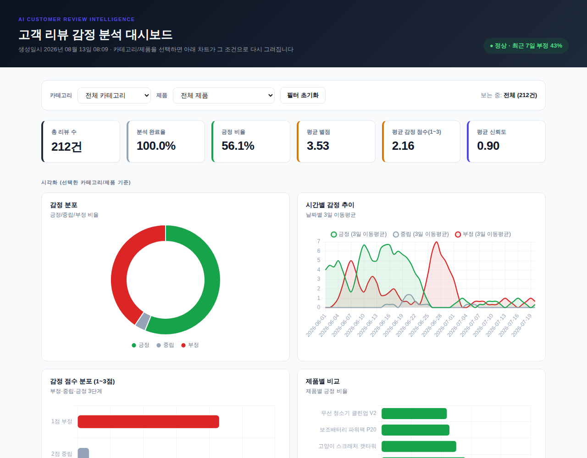
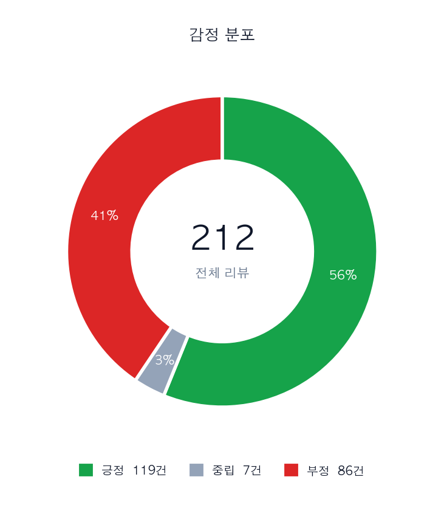
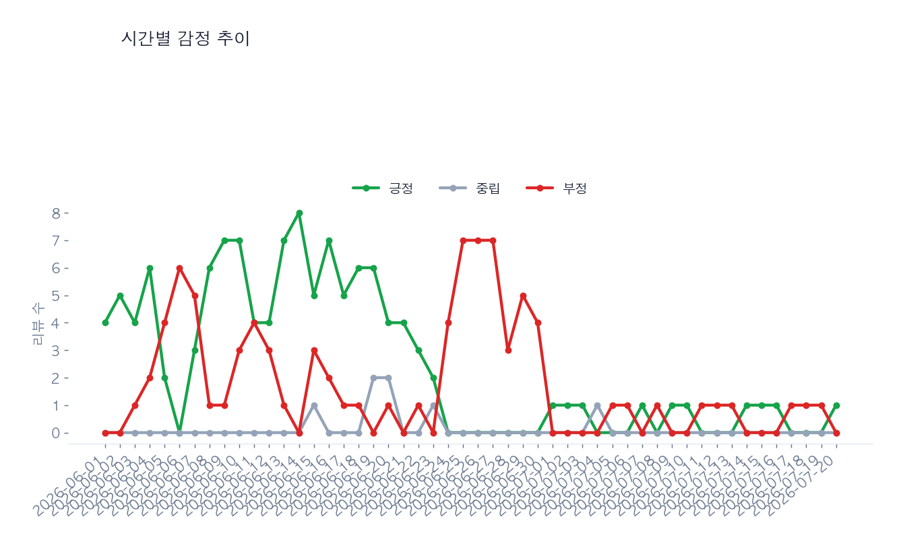
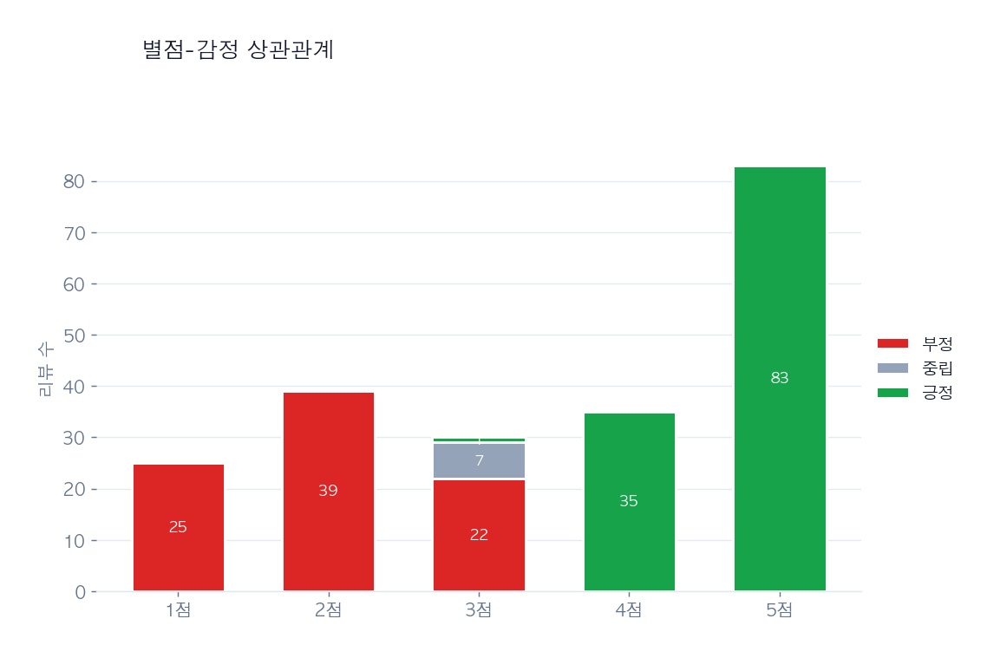
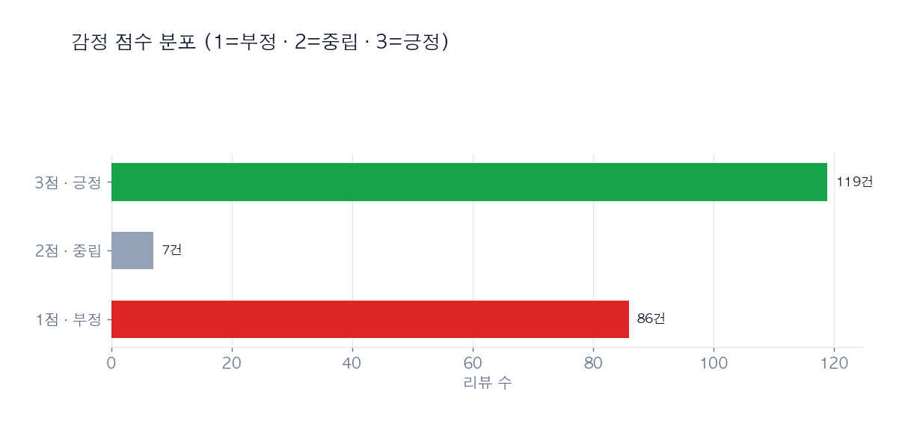
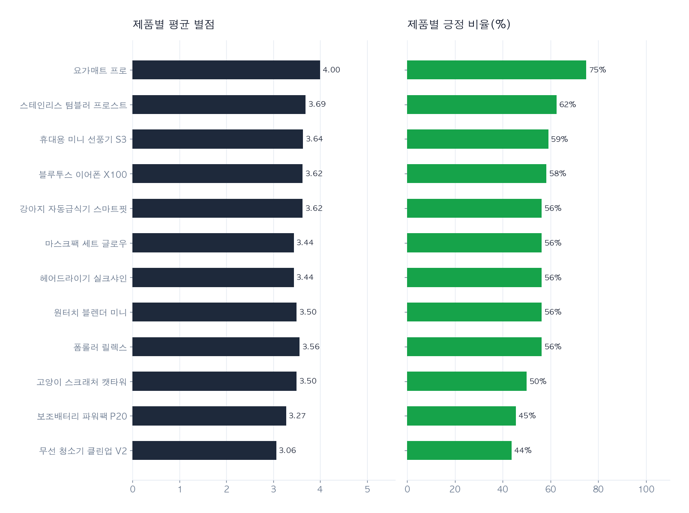
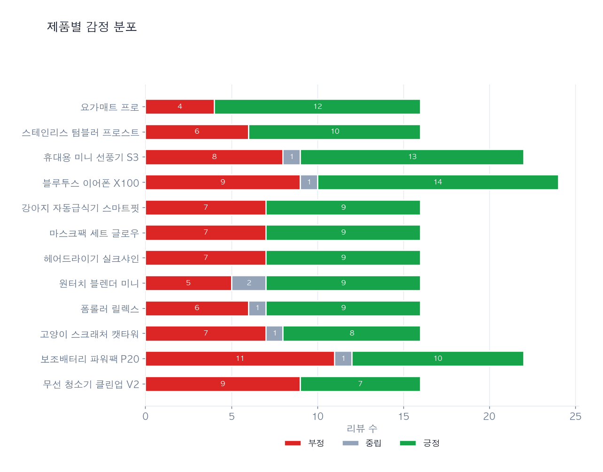
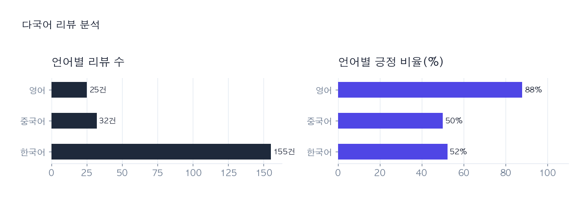

# 고객 리뷰 감정 분석 대시보드 — 완전 설명서 (초보자용)

> [Project C] AI 기반 고객 리뷰 감정 분석 대시보드 — Term Project 결과물
> 이 문서 하나만 읽으면 "무엇을, 왜, 어떻게 만들었는지"를 전부 이해할 수 있도록
> 초보자 눈높이에서 아주 자세히 설명합니다.

---

## 목차

0. [이 프로젝트를 한마디로 하면](#0-이-프로젝트를-한마디로-하면)
1. [5분 안에 실행해보기](#1-5분-안에-실행해보기)
2. [전체 데이터 흐름 (아키텍처)](#2-전체-데이터-흐름-아키텍처)
3. [프로젝트 폴더 구조](#3-프로젝트-폴더-구조)
4. [왜 raw/clean을 분리해서 저장할까요](#4-왜-rawclean을-분리해서-저장할까요)
5. [커맨드 18개 완전 정복](#5-커맨드-18개-완전-정복)
6. [소스 모듈 16개 하나씩 설명](#6-소스-모듈-16개-하나씩-설명)
7. [AI API 연동 상세 (키, 프롬프트, 폴백)](#7-ai-api-연동-상세-키-프롬프트-폴백)
8. [데이터베이스 구조 (SQLite 스키마)](#8-데이터베이스-구조-sqlite-스키마)
9. [차트는 어떻게 그려지나요 (matplotlib)](#9-차트는-어떻게-그려지나요-matplotlib)
10. [리포트 & HTML 대시보드가 만들어지는 과정](#10-리포트--html-대시보드가-만들어지는-과정)
11. [보너스 기능 4가지 상세](#11-보너스-기능-4가지-상세)
    - [11-1. 팀원 추가 기여: 멀티 프로바이더 / 모델 비교 / 측면 만족도](#11-1-팀원-추가-기여-멀티-프로바이더--모델-비교--측면-만족도)
12. [자동 테스트 코드 설명](#12-자동-테스트-코드-설명)
13. [에러가 나도 프로그램이 죽지 않는 이유](#13-에러가-나도-프로그램이-죽지-않는-이유)
14. [과제 목표 4가지 완전 정복](#14-과제-목표-4가지-완전-정복)
15. [요구사항 · 보너스 체크리스트](#15-요구사항--보너스-체크리스트)
16. [자주 묻는 질문 (FAQ)](#16-자주-묻는-질문-faq)
17. [더 쉽게 쓰기: menu/quickstart와 편의 기능](#17-더-쉽게-쓰기-menuquickstart와-편의-기능)
18. [실행 예시 모음 (전체 세션 시나리오)](#18-실행-예시-모음-전체-세션-시나리오)
19. [팀 역할 배분](#19-팀-역할-배분)

---

## 0. 이 프로젝트를 한마디로 하면

**"엑셀/CSV에 쌓인 고객 리뷰 수십\~수백 건을, AI가 대신 읽고 통계·차트·인사이트로
정리해주는 터미널 프로그램"** 입니다.

사람이 리뷰 1,000건을 읽으려면 며칠이 걸리지만, AI에게 시키면 몇 분이면 끝납니다. 다만
"긍정/부정" 딱지만 붙이고 끝나면 실제 의사결정에 쓸모가 없기 때문에, 이 프로그램은
**시간에 따른 감정 변화, 자주 나오는 불만 키워드, 별점과 감정의 상관관계**까지 뽑아내서
"그래서 무엇을 개선해야 하는지"까지 보여주는 것을 목표로 만들었습니다.

```
CSV/Excel 리뷰 파일  →  [이 프로그램]  →  차트 7종 + 종합 리포트 + HTML 대시보드
                                        + CSV/Excel/JSONL 내보내기
```

---

## 1. 5분 안에 실행해보기

> 💡 **터미널 명령어가 낯설다면** 아래 12단계를 하나씩 치는 대신, 설치 후 바로
> `python main.py menu` (번호로 고르는 대화형 메뉴) 또는
> `python main.py quickstart` (가져오기\~대시보드를 한 번에 실행)를 써보세요.
> 자세한 내용은 [17절](#17-더-쉽게-쓰기-menuquickstart와-편의-기능)에 있습니다.

```bash
# 0) 압축 풀고 폴더 진입
cd review_dashboard

# 1) 필요한 라이브러리 설치 (requests, matplotlib, openpyxl)
pip install -r requirements.txt
```

> ⚠️ **macOS(Homebrew Python)에서 `error: externally-managed-environment`가 뜨는 경우**
> 최신 macOS는 시스템 파이썬에 직접 `pip install`을 못 하게 막아둡니다. 아래 둘 중
> 하나로 해결하세요.
> ```bash
> # 방법 A (추천): 이 프로젝트 전용 가상환경 사용 — 시스템 파이썬을 건드리지 않아 안전합니다
> python3 -m venv .venv
> source .venv/bin/activate      # Windows는: .venv\Scripts\activate
> pip install -r requirements.txt
>
> # 방법 B (간단하지만 시스템 전역에 설치됨)
> pip install -r requirements.txt --break-system-packages
> ```
> 이 에러 때문에 라이브러리 설치가 실패하면, `openpyxl`/`matplotlib`이 없어서
> `export --format xlsx`나 `dashboard` 실행 시 `ModuleNotFoundError`가 뜹니다 —
> 별개의 문제가 아니라 설치가 안 된 것이 원인이니, 위 방법으로 설치를 먼저
> 성공시키면 함께 해결됩니다.

```bash
# 2) 샘플 리뷰 212건 가져오기
python main.py import --file sample_data/reviews_sample.csv

# 3) 데이터 정제 (이상한 값 걸러내고 형식 통일)
python main.py clean

# 4) AI로 감정 분석 (긍정/부정/중립 + 신뢰도)
python main.py analyze --unanalyzed

# 5) 전체 통계 요약 보기
python main.py stats

# 6) AI로 키워드/요약/개선제안 뽑기 (전체 리뷰 대상)
python main.py extract --sentiment all

# 7) 차트 7종 + 리포트 + HTML 대시보드 생성
python main.py dashboard --html

# 8) 결과를 CSV/Excel로 내보내기
python main.py export --format csv
python main.py export --format xlsx

# [보너스] 최근 7일 부정 리뷰 급증 알림
python main.py alert --days 7

# [보너스] 제품별 / 카테고리별 비교
python main.py compare --by product
python main.py compare --by category

# 자동 테스트 실행 (7건)
python -m unittest discover -s tests -v
```

실행이 끝나면 `output/` 폴더에 아래 파일들이 생깁니다.

| 파일 | 내용 |
|---|---|
| `sentiment_distribution.png` | 감정 분포 도넛 차트 |
| `sentiment_trend.png` | 시간에 따른 감정 변화 라인 차트 |
| `rating_sentiment_matrix.png` | 별점별 감정 분포 누적 막대 차트 |
| `sentiment_grade.png` | 감정 점수(1\~3, 부정\~긍정) 분포 차트 |
| `product_comparison.png` | 제품별 평균 별점/긍정비율 비교 |
| `product_sentiment_breakdown.png` | 제품별 긍정/중립/부정 실제 건수 (누적 막대) |
| `language_distribution.png` | [보너스] 언어(한/영/중)별 리뷰 수·긍정비율 |
| `dashboard_report.md` | 콘솔에 출력된 것과 같은 종합 리포트 (품질지표+TOP5+AI인사이트) |
| `dashboard.html` | [보너스] 위 모든 차트+통계를 한 페이지에 담은 웹페이지 |
| `reviews_export.csv/.xlsx/.jsonl` | 내보내기 결과 (감정 점수 컬럼 포함) |

> 💡 **API 키가 없어도** 위 과정이 전부 오류 없이 끝납니다. `ANTHROPIC_API_KEY`
> 환경변수를 설정하지 않으면 규칙 기반 폴백 분석기가 대신 동작합니다 (7절에서 자세히
> 설명합니다). 진짜 AI 분석 결과를 보고 싶다면 실행 전에 아래처럼 키를 설정하세요.
> ```bash
> export ANTHROPIC_API_KEY="sk-ant-여러분의-키"
> ```

### 실행 결과 미리보기 (스크린샷)

샘플 데이터(212건)로 위 과정을 실행하면 실제로 아래와 같은 결과물이 만들어집니다.
(`docs/screenshots/`에 미리 생성해 둔 예시 이미지이며, 직접 실행하면 `output/` 폴더에
동일한 파일이 생성됩니다.)

**`dashboard --html`로 생성한 HTML 대시보드** (`output/dashboard.html`)



**개별 차트 7종** (`output/*.png`)

| 감정 분포 (도넛) | 시간별 감정 추이 |
|---|---|
|  |  |

| 별점-감정 상관관계 | 감정 점수 분포 (1\~3점) |
|---|---|
|  |  |

| 제품별 비교 [보너스] | 제품별 감정 분포 |
|---|---|
|  |  |

**언어별 분포 [보너스: 다국어 지원]**



---

## 2. 전체 데이터 흐름 (아키텍처)

```
┌──────────────┐   import    ┌─────────────┐   clean    ┌──────────────┐
│ reviews.csv  │ ──────────▶ │ raw_reviews │ ─────────▶ │ clean_reviews│
│ (원본 파일)   │             │  (SQLite)   │            │  (SQLite)    │
└──────────────┘             └─────────────┘            └──────┬───────┘
                                                                 │ analyze (AI)
                                                                 ▼
                                                   ┌────────────────────────┐
                                                   │ clean_reviews          │
                                                   │ + sentiment/confidence │
                                                   └───────────┬────────────┘
                            ┌────────────────────────┬─────────┼───────────────┐
                            ▼                        ▼         ▼               ▼
                        list/show/stats          extract    dashboard        export
                        (조건 조회)              (AI 요약)   (차트+리포트)   (CSV/xlsx/jsonl)
                                                      │            │
                                                      ▼            ▼
                                              extractions      output/*.png
                                              (키워드/요약)     dashboard.html
```

핵심은 **"원본(raw) → 정제(clean) → 분석결과(sentiment/confidence) → 활용(조회/차트/리포트/내보내기)"**
순서로 데이터가 단계별로 정제·보강되며 흘러간다는 점입니다. 각 단계는 독립된 커맨드이자
독립된 파이썬 모듈로 분리되어 있습니다.

---

## 3. 프로젝트 폴더 구조

```
review_dashboard/
├── main.py                      # CLI 진입점 (argparse, 서브커맨드 12개)
├── config.json                  # 설정 파일 (API 키 환경변수명, dedup 정책 등)
├── requirements.txt             # pip 설치 목록
├── .gitignore
├── README.md                    # 지금 읽고 있는 이 문서
│
├── sample_data/
│   └── reviews_sample.csv       # 샘플 리뷰 212건 (제품 12종 × 카테고리 6종, 한/영/중 혼합)
│
├── src/                         # 실제 로직이 담긴 16개 모듈
│   ├── __init__.py
│   ├── db.py                    # SQLite 저장소 (raw/clean/extractions 테이블)
│   ├── ai_client.py             # Claude API 호출 + 규칙기반 폴백
│   ├── ingest.py                # import / add 커맨드 로직
│   ├── cleaner.py                # clean 커맨드 로직
│   ├── analyzer.py              # analyze 커맨드 로직
│   ├── extractor.py             # extract 커맨드 로직
│   ├── query.py                  # list / show / stats 커맨드 로직
│   ├── visualizer.py            # dashboard 차트 생성 (matplotlib)
│   ├── reporter.py              # 리포트 + HTML 대시보드 생성
│   ├── exporter.py              # export 커맨드 로직
│   ├── alerts.py                # [보너스] 감정 급증 알림
│   ├── compare.py               # [보너스] 제품/카테고리 비교
│   ├── aspects.py               # [팀원 기여] 측면(상품/배송/응대) 만족도 분류 + 5점 척도
│   ├── model_runs.py            # [팀원 기여] 모델 스냅샷 저장/시드 헬퍼
│   ├── model_display.py         # [팀원 기여] 모델 id -> 화면 표시명 정리
│   ├── utils.py                 # 텍스트/날짜/별점 정규화, 해시, 언어감지 등 공통 함수
│   ├── ui.py                    # [사용자 편의] 색상/표/진행률 바/프롬프트 터미널 UI 헬퍼
│   ├── logger_setup.py          # 로깅(logging) 설정
│   ├── envfile.py               # [사용자 편의] .env 파일 로드/저장 (API 키 영구 저장)
│   ├── dashboard_interactive.js # [보너스] HTML 대시보드 카테고리/제품 필터 자바스크립트
│   └── vendor/
│       └── chart.umd.js         # Chart.js 라이브러리 내장(오프라인 작동용, CDN 아님)
│
├── tests/                       # 자동 테스트
│   ├── __init__.py
│   ├── test_utils.py            # utils.py 함수 단위 테스트
│   ├── test_pipeline_smoke.py   # import→clean→analyze 통합 테스트 + 대화형 대시보드 검증
│   ├── test_ui.py               # [사용자 편의] 한글 표시 폭/표 정렬 테스트
│   ├── test_envfile.py          # [사용자 편의] .env 파일 파싱/로드/저장 테스트
│   ├── test_main_cli.py         # [사용자 편의] CLI 통합 테스트 (menu/quickstart/search/setup/-y 등)
│   ├── test_aspects_and_models.py  # [팀원 기여] 측면 만족도 + 멀티 프로바이더 + 모델 비교 테스트
│   └── test_insights.py         # [팀원 기여] AI 추출 결과가 나중 실패로 가려지지 않는지 테스트
│
├── docs/
│   └── screenshots/             # README용 미리보기 이미지 (차트 7종 + HTML 대시보드)
│
├── data/                        # (실행 시 생성) SQLite DB 파일 위치
├── logs/                        # (실행 시 생성) 로그 파일 위치
└── output/                      # (실행 시 생성) 차트/리포트/내보내기 파일 위치
```

> `data/`, `logs/`, `output/`은 처음에는 비어있고(`.gitkeep`만 존재), 프로그램을
> 실행하면 그 안에 결과물이 자동으로 생성됩니다.

---

## 4. 왜 raw/clean을 분리해서 저장할까요

실무 데이터 파이프라인은 거의 항상 **"원본(raw) → 정제(clean) → 분석결과"** 3단계로
나눕니다. 이유는 다음과 같습니다.

1. **원본 파일에는 지저분한 데이터가 섞여 있습니다.** 별점이 8점으로 잘못 입력되어
   있거나, 리뷰 텍스트가 아예 비어있거나, 날짜 형식이 `2026/06/01`과 `2026.06.01`로
   제각각일 수 있습니다. 이런 걸 안 걸러내고 바로 통계를 내면 결과가 왜곡됩니다.
2. **원본을 보존해두면 나중에 다시 정제할 수 있습니다.** 만약 정제 규칙에 버그가
   있었다는 걸 나중에 알게 되면, `raw_reviews`는 그대로 남아있으니 정제만 다시 돌리면
   됩니다. 반대로 원본을 덮어써버렸다면 처음부터 다시 데이터를 받아와야 합니다.
3. **"정제된 데이터"와 "AI 분석 결과"도 분리되어 있습니다.** `clean_reviews` 테이블에
   `sentiment`, `confidence` 컬럼이 있지만, 이 값들은 `analyze` 커맨드를 실행하기
   전까지는 비어(NULL)있습니다. 나중에 더 좋은 AI 모델이 나오면 `analyze --all`로
   정제는 그대로 둔 채 분석만 다시 돌릴 수 있습니다.

이 프로젝트에서는 이 원칙을 그대로 구현해서, `raw_reviews`(원본) → `clean_reviews`
(정제+분석결과)라는 SQLite 테이블 두 개로 나누어 저장합니다.

---

## 5. 커맨드 18개 완전 정복

각 커맨드를 **무엇을 하는지 / 주요 옵션 / 실행 예시와 실제 출력**까지 함께 설명합니다.

### 5-1. `import` — 리뷰 파일 가져오기

```bash
python main.py import --file sample_data/reviews_sample.csv --dedup skip
```

- CSV(`.csv`) 또는 Excel(`.xlsx`) 파일을 읽어서 `raw_reviews` 테이블에 저장합니다.
- 컬럼 이름이 정확히 `review_text`가 아니어도 됩니다. `text`, `content`, `리뷰내용` 등
  여러 별명(alias) 중 하나만 맞으면 자동으로 인식합니다.
- `--dedup skip`(기본값)이면 이미 있는 리뷰(텍스트+제품명이 같음)는 건너뛰고,
  `--dedup upsert`면 기존 값을 새 값으로 덮어씁니다.

```
[INFO] 파일 로드: sample_data/reviews_sample.csv
[INFO] 총 212건 감지, 유효 212건, 스킵 0건 (중복/필수필드 누락, 정책=skip)
[INFO] raw 저장소에 저장 완료
```

### 5-2. `add` — 리뷰 1건 수동 추가

```bash
python main.py add --text "배송도 빠르고 품질도 좋아요" --rating 5 --date 2026-07-01 --product "테스트 제품" --category "테스트 카테고리"
```

관리자가 리뷰 등록 폼 등을 통해 리뷰 1건을 직접 넣고 싶을 때 사용합니다. 내부적으로는
`import`와 동일한 raw 저장소에 들어갑니다.

### 5-3. `clean` — 데이터 정제

```bash
python main.py clean --dedup skip
```

`raw_reviews` 중 아직 정제되지 않은 행을 가져와서 아래 6가지 규칙을 적용한 뒤
`clean_reviews`에 저장합니다.

| 규칙 | 설명 |
|---|---|
| 필수 필드 검증 | 텍스트가 비어있으면 제외 |
| 텍스트 정규화 | 여러 칸 공백/개행 → 한 칸으로 |
| 별점 범위 검증 | 1\~5 벗어나면 `NULL` 처리 (에러 X, 통계에서 자동 제외) |
| 날짜 형식 통일 | `2026/06/01`, `2026.06.01` 등을 `2026-06-01`로 통일 |
| 짧은 리뷰 필터링 | 5자 미만(설정 가능)이면 제외 |
| 중복 처리 | 정제된 텍스트 기준으로 다시 한 번 skip/upsert 적용 |

```
[INFO] 정제 대상 원본 리뷰: 212건
[INFO] 정제 완료: 신규 212건, 갱신 0건, 짧은 리뷰 제외 0건, 중복 스킵 0건
```

### 5-4. `analyze` — AI 감정 분석

```bash
python main.py analyze --unanalyzed --limit 20   # 아직 분석 안 된 것만 (기본값)
python main.py analyze --all                     # 전체 재분석
python main.py analyze --id 37                    # 특정 리뷰 1건만
```

AI(또는 API 키가 없으면 규칙 기반 폴백)에게 리뷰 텍스트를 보내 `positive/negative/neutral`
과 신뢰도(0.0\~1.0)를 받아 저장합니다. 실패한 리뷰는 로그만 남기고 건너뛰며, 전체 배치가
중단되지 않습니다.

```
[INFO] 분석 대상: 212건
[INFO] [1/48] ID=1 분석 완료: neutral (0.55)
...
[INFO] 분석 완료: 212건 성공, 0건 실패
```

> 💡 여기서 저장되는 `0.55` 같은 숫자는 **신뢰도(confidence)** — "이 판단이 맞다고
> 얼마나 확신하는가"입니다. "감정 분류를 숫자로 나타낸" **감정 점수(1\~3)**는
> 별개 개념이며, 7-5절에서 자세히 설명합니다.

### 5-5. `extract` — AI 키워드/요약/개선제안 추출

```bash
python main.py extract --sentiment negative --date-from 2026-06-01 --date-to 2026-06-30 --product "블루투스 이어폰 X100"
python main.py extract --sentiment all   # dashboard 실행 전 추천
```

조건(감정/기간/제품/카테고리)에 맞는 리뷰들을 모아 AI에게 "공통 불만/칭찬이 뭐야?"라고
물어봅니다. 결과로 **긍정/부정 키워드, 전체 요약, 개선 제안, 불만·칭찬 유형별 집계**를
받아 별도 저장(`extractions` 테이블)하고 `dashboard`에서 재사용합니다.

```
=== 리뷰 키워드/요약 분석 (감정=전체) ===
[긍정 키워드] 좋, 편해, 만족, 훌륭, 추천
[부정 키워드] 불편, 늦, 불량, 실망, 안돼

[주요 불만/칭찬 유형]
1. 배송 (1건): 늦, 배송
2. 품질 (1건): 불량, 나빠, 최악
3. 서비스 (3건): 불편, 안돼, 안됨
4. 가격/기타 (2건): 실망, 환불, 반품
```

### 5-6. `list` — 목록 조회

```bash
python main.py list --sentiment negative --rating-min 1 --rating-max 3 --category 전자기기 --language ko --page 1 --size 5 --sort review_date --order desc
```

지원 필터: `--sentiment`, `--rating`(정확 일치), `--rating-min/--rating-max`(범위),
`--date-from/--date-to`, `--product`, `--category`, `--language`(ko/en, 보너스). 정렬은
`--sort`(id/rating/review_date/sentiment/confidence)와 `--order`(asc/desc)로 조정합니다.

### 5-7. `search` — [편의 기능] 키워드 자유 검색

```bash
python main.py search "배송 지연"
```

`list`는 감정/별점/기간 같은 **구조화된 조건**으로 걸러내는 반면, `search`는 리뷰
원문이나 제품명 안에 특정 **단어가 포함되어 있는지** 자유롭게 찾습니다. "정확히
어떤 조건을 걸어야 할지 모르겠고 그냥 이 단어 들어간 리뷰를 다 보고 싶다" 싶을 때
`list --sentiment ...` 조합을 고민하지 않고 바로 쓸 수 있습니다.

```
── 검색 결과: '배송' (1/1 페이지, 총 3건) ──
┌────┬──────────────────────┬──────────────────────────────────┬───────┬──────────┐
│ ID │ 제품                 │ 내용                             │ 별점  │ 감정     │
├────┼──────────────────────┼──────────────────────────────────┼───────┼──────────┤
│ 1  │ 블루투스 이어폰 X100 │ 배송이 정말 빨라서 놀랐어요. 주… │ ★★★★★ │ 중립 3/5 │
│ 37 │ 블루투스 이어폰 X100 │ 배송이 너무 늦어요. 일주일 넘게… │ ★☆☆☆☆ │ 부정 2/5 │
└────┴──────────────────────┴──────────────────────────────────┴───────┴──────────┘
```

### 5-8. `show` — 리뷰 1건 상세 조회

```bash
python main.py show --id 37
```

원문, 별점, 제품/카테고리, 언어, **감정분류(신뢰도 포함) + 감정 점수(1\~3)**까지 한 번에
보여줍니다.

```
감정분류 : negative (신뢰도 0.7 — 이 판단이 맞다고 확신하는 정도)
감정점수 : 2/5 (나쁨) — 감정이 얼마나 강한지의 정도
```

### 5-9. `stats` — 전체 통계 요약

```bash
python main.py stats
```

총 리뷰 수, 분석 완료율, 감정별 비율, **감정 점수(1\~3) 분포**, 별점 분포, 평균 별점,
평균 감정 점수, 평균 신뢰도, 그리고 **언어 분포(보너스: 다국어 지원 확인용)**까지
출력합니다.

### 5-10. `dashboard` — 차트 + 종합 리포트 생성

```bash
python main.py dashboard --format md --html --alert-days 7
```

matplotlib 차트 7종을 그려 PNG로 저장하고, 품질지표+TOP5 키워드+AI 인사이트+감정점수
분포+감정급증 알림을 담은 리포트를 콘솔에 출력하면서 파일(`.md`/`.txt`)로도 저장합니다.
`--html`을 주면 보너스 과제인 **단일 HTML 대시보드**도 함께 만듭니다.

> 🖱️ **HTML 대시보드는 카테고리/제품을 골라서 그 조건만 다시 볼 수 있습니다.**
> `output/dashboard.html`을 열면 상단에 카테고리·제품 선택 드롭다운이 있고, 고르는
> 즉시 KPI 숫자와 모든 차트가 그 조건에 맞게 다시 그려집니다(제품을 특정하면 "제품별
> 비교/제품별 감정 분포" 차트는 비교 대상이 없어 자동으로 숨겨집니다). 리뷰 데이터와
> 차트 라이브러리(Chart.js)를 파일 안에 통째로 넣어뒀기 때문에, **인터넷 연결 없이
> 파일만 더블클릭해도** 그대로 작동합니다.

### 5-11. `export` — 결과 내보내기

```bash
python main.py export --format csv --sentiment negative
python main.py export --format xlsx --rating-min 4
python main.py export --format jsonl --category 생활가전
```

`csv`/`jsonl`/`xlsx` 3가지 포맷을 모두 지원하며(요구사항은 최소 2개), `--sentiment`,
`--rating-min`, `--category`로 필터링할 수 있습니다. 내보내기 파일에는 `sentiment`,
`confidence`뿐 아니라 **`sentiment_score`(1\~3)/`sentiment_grade`(부정\~긍정)**
컬럼도 함께 포함됩니다.

### 5-12. `alert` — [보너스] 감정 급증 알림

```bash
python main.py alert --days 7
```

최근 N일간의 부정 리뷰 비율을, 그 이전 기간과 비교해서 뚜렷하게 높아졌으면 경고를
띄웁니다. `dashboard` 실행 시에도 자동으로 함께 검사됩니다.

```
[WARNING] ⚠ 부정 리뷰 급증 경고! 최근 7일(2026-06-24~2026-06-30) 부정 비율 41.7%
(이전 대비 기준 5.6%) - 원인 파악이 필요합니다.
```

### 5-13. `compare` — [보너스] 제품/카테고리별 비교 분석

```bash
python main.py compare --by product
python main.py compare --by category --targets "전자기기,생활가전"
```

리뷰 수, 평균 별점, 긍정 비율을 제품별 또는 카테고리별로 나란히 비교하고, 가장
좋은/나쁜 대상을 알려줍니다.

### 5-14. `models` / `compare-models` — [팀원 추가 기여] 모델별 비교

```bash
python main.py models                        # 지금까지 analyze를 돌릴 때마다 자동 저장된 스냅샷 목록
python main.py compare-models --a 1 --b 2     # 스냅샷 두 개(예: provider/모델을 바꿔가며 돌린 결과)를 비교
```

`analyze`를 실행할 때마다 그 결과가 자동으로 스냅샷(`model_runs` 테이블)에
기록됩니다. `config.json`의 `ai.provider`/모델을 바꿔서(예: Claude → Gemini)
`analyze --all`을 다시 돌리면 새 스냅샷이 하나 더 쌓이고, 그 두 스냅샷의
ID를 `--a`/`--b`에 넣으면 일치율·감정분포 차이·불일치 사례를 볼 수 있습니다.
자세한 배경은 11-1절을 참고하세요.

---

## 6. 소스 모듈 16개 하나씩 설명

`src/` 폴더 안의 모든 모듈이 각각 무슨 역할을 하는지, 초보자 눈높이에서 한 줄씩
정리했습니다. (코드 한 파일에 다 몰아넣지 않고 기능별로 나눈 것이 요구사항입니다.)

| 모듈 | 역할 | 핵심 함수 |
|---|---|---|
| `db.py` | SQLite를 열고, 3개 테이블(raw_reviews/clean_reviews/extractions)에 대한 모든 SQL을 담당하는 "저장소" 계층 | `Database` 클래스 (insert/upsert/query/get_stats 등) |
| `ai_client.py` | Claude API에 HTTP 요청을 보내고 JSON 응답을 파싱, 실패 시 규칙기반 폴백으로 전환 | `analyze_sentiment()`, `extract_insights()` |
| `ingest.py` | CSV/Excel을 읽어 raw 저장소에 넣는 `import`/`add` 로직 | `import_file()`, `add_single_review()` |
| `cleaner.py` | raw → clean 정제 규칙 적용 | `clean_all()` |
| `analyzer.py` | clean_reviews의 리뷰들을 AI로 감정분석 | `analyze_reviews()` |
| `extractor.py` | 조건별 리뷰를 모아 AI로 키워드/요약 추출 | `extract_insights()`, `print_insights()` |
| `query.py` | list/show/stats 커맨드의 조회·출력 로직 | `list_reviews()`, `show_review()`, `print_stats()` |
| `visualizer.py` | matplotlib으로 차트 7종을 그려 PNG로 저장, 한글 폰트 적용 | `generate_all_charts()` |
| `reporter.py` | 텍스트 리포트 + HTML 대시보드 생성 | `build_report_text()`, `build_html_dashboard()` |
| `exporter.py` | clean_reviews를 CSV/JSONL/Excel로 내보내기 | `export_data()` |
| `alerts.py` | [보너스] 최근 N일 부정비율 급증 감지 | `check_negative_spike()` |
| `compare.py` | [보너스] 제품/카테고리별 지표 비교 | `compare_by()`, `print_comparison()` |
| `ui.py` | [사용자 편의] 외부 라이브러리 없이 색상 메시지/표/진행률 바/확인 프롬프트를 그리는 터미널 UI 계층 | `success()`, `table()`, `progress()`, `confirm()`, `choose()` |
| `envfile.py` | [사용자 편의] `.env` 파일을 읽고 써서 API 키 등을 세션 간에 유지 (외부 라이브러리 불필요) | `load_dotenv()`, `write_dotenv()`, `ensure_gitignored()` |
| `utils.py` | 텍스트 정규화, 날짜/별점 검증, 중복 해시, 언어 감지, 감정 점수 계산 등 여러 모듈이 공유하는 순수 함수 모음 | `normalize_text()`, `normalize_date()`, `normalize_rating()`, `dedup_hash()`, `detect_language()`, `sentiment_grade()` |
| `logger_setup.py` | 콘솔 + 파일(`logs/app.log`)에 동시에 로그를 남기는 logging 설정 | `setup_logger()` |

`main.py`는 이 모듈들을 조립해서 `argparse` 서브커맨드로 노출하는 얇은 "지휘자"
역할만 하고, 실제 로직은 전부 `src/` 안에 있습니다. 이렇게 나누면 "이 기능이 어디에
있지?"를 찾을 때 파일 이름만 보고도 바로 짐작할 수 있다는 장점이 있습니다.

---

## 7. AI API 연동 상세 (키, 프롬프트, 폴백)

### 7-1. API 키는 어디서 가져오나요

과제 제약사항("API 키는 코드에 직접 작성하지 않는다")에 맞춰, `config.json`에는
**"어떤 환경변수 이름을 볼지"**만 적혀 있습니다.

```json
"ai": { "api_key_env": "ANTHROPIC_API_KEY", ... }
```

`ai_client.py`는 실행 시점에 `os.environ.get("ANTHROPIC_API_KEY")`로 실제 키 값을
읽어옵니다. 코드나 설정 파일 어디에도 진짜 키 문자열은 존재하지 않습니다.

### 7-2. 실제 요청은 어떻게 생겼나요

`requests.post()`로 `https://api.anthropic.com/v1/messages`에 직접 HTTP 요청을
보냅니다 (공식 SDK 없이 requests 직접 호출 — 개발환경 제약사항 충족). 감정분석 요청의
system 프롬프트는 이렇게 생겼습니다.

```python
system = (
    "너는 전자상거래 고객 리뷰 감정 분석 전문가다. ... "
    "반드시 다른 설명 없이 JSON만 출력하라: "
    '{"sentiment": "positive|negative|neutral", "confidence": 0.0}'
)
```

"자유 문장이 아니라 반드시 이 JSON 형식으로만 답하라"고 못박아두는 것이 핵심입니다.
이렇게 해야 응답을 자동으로 파싱해서 DB 컬럼에 바로 넣을 수 있습니다.

### 7-3. API 키가 없으면? — 규칙 기반 폴백 (그리고 키는 있는데 호출이 실패하면?)

`ANTHROPIC_API_KEY`가 **아예 없으면** `ai_client.py`는 실제 API 대신, 리뷰 텍스트에 특정
긍정/부정 단어(`좋`, `만족`, `불량`, `늦` 등 한/영/중 혼합)가 몇 개 들어있는지 세어
감정을 추정하는 간단한 로직으로 자동 전환합니다.

```
[WARNING] ANTHROPIC_API_KEY 환경변수가 설정되지 않았습니다.
실제 AI 호출 대신 규칙 기반 폴백 분석기를 사용합니다.
```

이건 "진짜 AI"가 아니라 **데모/테스트용 안전장치**입니다. 덕분에 키가 없어도 전체
파이프라인을 처음부터 끝까지 막힘없이 검증할 수 있습니다.

**키는 설정했는데 크레딧 부족·인증 오류 등으로 호출 자체가 실패하는 경우는 다릅니다.**
이 경우엔 조용히 폴백으로 넘어가지 않고, 과제 요구사항 "API 실패 시 로깅 후 스킵"
그대로 **진짜 실패로 처리**합니다 — `analyze`는 해당 리뷰를 건너뛰고(`sentiment`가
비어있는 채로 남음) `[ERROR]`를 로그에 남기며, 최종 결과에도 "성공/실패" 건수가
정직하게 집계됩니다.

```
[ERROR] AI API 호출 실패 (status=400): {"type":"error","error":{"type":"invalid_request_error",
"message":"Your credit balance is too low to access the Anthropic API. ..."}}
[ERROR] [1/100] ID=1 분석 실패: AI 감정분석 API 호출에 실패했습니다 (...)
...
[INFO] 분석 완료: 0건 성공, 212건 실패
⚠ 분석 완료: 0건 성공, 212건 실패 (logs/app.log 확인)
```

> 💡 **"API 키를 넣었는데 결과가 여전히 폴백 같아요"** 싶다면, 콘솔에 위와 같은
> `credit balance is too low` 에러가 있는지 확인하세요. 키 자체는 정상 인식되고 있고,
> `platform.claude.com` → **Billing**에서 결제수단/크레딧을 등록하면 해결됩니다.
> (`extract`는 요구사항에 "실패 시 스킵"이 명시되어 있지 않아, 실패해도 대시보드가
> 비지 않도록 규칙 기반 결과로 대체하되 `[WARNING]` 로그로 그 사실을 명확히 남깁니다.)

### 7-4. 사용 모델

- 감정분석(`analyze`): `claude-haiku-4-5-20251001` — 리뷰 1건씩 대량으로 호출하므로
  빠르고 저렴한 모델을 기본값으로 사용합니다.
- 키워드/요약 추출(`extract`): `claude-sonnet-5` — 여러 리뷰를 한 번에 종합 분석해야
  하므로 더 높은 추론 성능이 필요한 모델을 기본값으로 사용합니다.
- 둘 다 `config.json`의 `ai.sentiment_model` / `ai.extract_model`에서 바꿀 수 있습니다.

### 7-4-1. `analyze`는 되는데 `extract`만 계속 폴백으로 도는 경우

`analyze`는 리뷰 1건당 `{"sentiment":"positive","confidence":0.92}`처럼 아주 짧은
응답만 필요하지만, `extract`는 긍정/부정 키워드 각 5개(+등장횟수)·요약문·개선제안·
유형별 집계까지 **훨씬 긴 JSON**을 한 번에 요구합니다. 이 둘이 같은
`ai.max_tokens` 예산을 공유하면, extract의 응답이 중간에 잘려서 JSON 파싱이
실패하고 — API 키가 멀쩡한데도 — 조용히 규칙 기반 폴백으로 넘어가는 문제가
있었습니다. 그래서 `config.json`에 `ai.extract_max_tokens`(기본 4096, `max_tokens`
의 4배)를 별도로 두었고, 응답이 max_tokens에 걸려 잘린 경우와 파싱에 실패한
경우 모두 `logs/app.log`에 원인이 남도록 고쳤습니다(예전에는 이 경우 아무
로그도 안 남아 원인 파악이 어려웠습니다). 리뷰 건수가 늘어날수록 AI가 만들려는
요약이 한없이 길어지는 것도 근본 원인이라, **프롬프트에도 "키워드는 최대 5개,
유형별 집계는 최대 5개, 예시는 유형당 최대 3개"처럼 명시적인 상한을 못 박아서**
리뷰가 많아져도 응답 길이가 안정적으로 유지되도록 했습니다.

```
[ERROR] AI 추출 응답을 JSON으로 파싱하지 못했습니다. 원문 일부: '{"positive_keywords": [...'
[WARNING] AI 키워드/요약 추출 호출이 실패해 규칙 기반 결과로 대체합니다 (...응답 잘림 등 - logs/app.log 확인).
```

**응답 길이를 늘리고 나니, 이번엔 타임아웃이 새로 발생할 수 있습니다.** 리뷰
212건을 한 프롬프트에 담고 최대 4096 토큰까지 생성하게 하면, 모델이 답을 다
만드는 데 `analyze`(리뷰 1건, 응답 몇십 토큰)보다 훨씬 오래 걸립니다. 이것도
같은 이유로 `ai.request_timeout_sec`(analyze용, 기본 30초)와
`ai.extract_timeout_sec`(extract 전용, 기본 120초)를 분리했습니다.

```
[ERROR] AI API 요청이 120초 안에 끝나지 않아 타임아웃되었습니다 (요청이 크거나
서버가 느린 경우 흔함 - config.json의 request_timeout_sec/extract_timeout_sec를
늘려보세요).
```

> 💡 여전히 폴백만 돈다면 `logs/app.log`에서 위 `[ERROR]` 줄을 찾아보세요. 원문이
> 중간에 뚝 끊겨 있다면 응답 잘림이 원인이니 `extract_max_tokens`를 더 늘려보시고,
> 그게 아니라 `status=4xx` 에러라면 7-3절(크레딧/인증 문제)을 참고하세요.

### 7-5. 신뢰도(confidence) vs 감정 점수(1\~3) — 헷갈리기 쉬운 두 개념

과제 문제기술의 "감정(긍정/부정/중립)과 신뢰도 점수(0.0\~1.0)"라는 문구를 "감정이 얼마나
강한지의 점수"로 오해하기 쉬운데, 사실 이 둘은 다른 개념입니다.

| 개념 | 값 | 의미 | 예시 |
|---|---|---|---|
| **신뢰도 (confidence)** | 0.0\~1.0 | AI가 자기 판단을 얼마나 **확신**하는가 | "이 리뷰가 부정이라고 91% 확신함" |
| **감정 점수 (sentiment score)** | 1\~3 | 감정 분류를 그대로 숫자로 나타낸 값 (부정/중립/긍정) | "이 리뷰는 3점 만점에 3점(긍정)" |

이 프로젝트는 과제 스펙이 명시한 신뢰도(confidence)를 그대로 저장하면서, **추가로**
`sentiment`(3분류)를 숫자 점수로도 바로 쓸 수 있게 `utils.sentiment_grade()` 함수를
만들었습니다. 새로 AI를 호출하지 않고 이미 저장된 값으로 즉석 계산하므로 비용이
들지 않습니다.

```python
# src/utils.py
def sentiment_grade(sentiment, confidence=None, strong_threshold=0.75):
    # positive -> 3점 (긍정)
    # neutral  -> 2점 (중립)
    # negative -> 1점 (부정)
```

> 💡 처음엔 신뢰도까지 반영해서 "아주나쁨\~아주좋음" 5단계로 세분화했었는데, 실제
> 기업 대시보드(NPS/CSAT 계열)에서 감정 점수는 보통 이렇게 단순하게 3단계(부정/중립/
> 긍정)로 보여주는 경우가 많아서 이 방식으로 바꿨습니다. `confidence`(신뢰도) 정보는
> 사라지지 않고 품질 지표의 "평균 신뢰도"로 별도로 계속 보여줍니다 — 두 개념이 아예
> 다르다는 걸 명확히 하려고 의도적으로 분리해뒀습니다.

`confidence`/`strong_threshold` 인자는 이전 버전과의 호환을 위해 남겨뒀지만, 3단계로
단순화하면서 점수 계산에는 더 이상 쓰이지 않습니다. 이 감정 점수는 `show`/`list`/
`stats`/`export`/`dashboard` 전체에 반영되어 있고, 전용 차트(`sentiment_grade.png`)도
생성됩니다.

---

## 8. 데이터베이스 구조 (SQLite 스키마)

```
raw_reviews                          clean_reviews
├─ id (PK)                           ├─ id (PK)
├─ review_text                       ├─ raw_id (FK → raw_reviews.id)
├─ rating                            ├─ review_text
├─ review_date                       ├─ rating
├─ product                           ├─ review_date
├─ category                          ├─ product
├─ source_file                       ├─ category
├─ imported_at                       ├─ language          ← 보너스: ko/en 자동판별
├─ dedup_hash (UNIQUE)               ├─ dedup_hash (UNIQUE)
└─ is_cleaned (0/1)                  ├─ cleaned_at
                                      ├─ sentiment          ← analyze 이후 채워짐
                                      ├─ confidence          ← analyze 이후 채워짐
                                      └─ analyzed_at

extractions
├─ id (PK)
├─ extraction_type
├─ condition_desc      (예: "감정=negative, 제품=X100")
├─ result_json         (긍정/부정 키워드, 요약, 개선제안, 유형별 집계)
└─ created_at
```

메모리(List/Dict)만으로 데이터를 들고 있는 게 아니라, 실제 `.db` 파일
(`data/reviews.db`)에 영구 저장되므로 프로그램을 껐다 켜도 데이터가 사라지지 않습니다.

---

## 9. 차트는 어떻게 그려지나요 (matplotlib) — 디자인 시스템 적용

### 9-1. 공통 디자인 토큰

`visualizer.py` 상단의 `PALETTE` 딕셔너리 하나로 5개 차트의 색상을 전부 통일했습니다.
긍정(에메랄드 `#1FAF6B`)·중립(슬레이트 `#9BA3B4`)·부정(레드 `#E5484D`) 3색은 모든
차트와 `dashboard.html`에서 항상 같은 의미로 사용되어, 어떤 차트를 보든 "초록=긍정"을
바로 알아볼 수 있습니다. `apply_theme()` 함수가 그리드/여백/폰트 크기/스파인(축 테두리)
같은 스타일을 한 번에 설정해서 5개 차트가 같은 룩앤필을 갖도록 만들었습니다.

### 9-2. 숫자 집계 → 그림으로 바뀌는 과정 (도넛 차트 예시)

1. SQL로 감정별 건수를 센다: `{"positive": 17, "neutral": 24, "negative": 7}`
2. `ax.pie(..., wedgeprops=dict(width=0.42))`로 가운데가 뚫린 **도넛형** 차트를 그리고,
   중앙에 총 리뷰 건수를 큰 숫자로 얹어 "한눈에 전체 규모"가 보이게 만든다.
3. `fig.savefig(..., bbox_inches="tight", facecolor="white")`로 화면이 아니라
   **파일로 저장**한다 (`matplotlib.use("Agg")` 덕분에 화면 없는 서버 환경에서도 그래프를
   그릴 수 있습니다).

시간별 추이(라인 차트)는 날짜별로 감정 건수를 누적시킨 뒤(`defaultdict`), 날짜 순서로
정렬해서 `ax.plot()`으로 선을 그립니다. 별점-감정 누적 막대와 제품/언어 비교 차트는
막대마다 실제 값(건수·%)을 직접 라벨링해서(`_label_bars()`) 숫자를 다시 세지 않아도
바로 읽히도록 만들었습니다.

### 9-3. 한글이 깨지지 않는 이유

matplotlib 기본 폰트는 한글을 지원하지 않아서, 아무 설정도 안 하면 글자가 네모
박스(□□□)로 깨집니다. `visualizer.py`의 `apply_korean_font()`가 시스템에 설치된
한글 폰트(Noto Sans CJK KR 등)를 찾아 `matplotlib`에 등록하고 전역 폰트로 지정합니다.
`config.json`의 `font_candidates` 목록에 여러 폰트 후보가 순서대로 있어서, 실행
환경(리눅스/맥/윈도우)이 달라져도 유연하게 대응합니다.

### 9-4. 생성되는 차트 7종

| 파일 | 종류 | 요구사항 |
|---|---|---|
| `sentiment_distribution.png` | 도넛 차트 (중앙 총건수 표시) | 필수 (감정 분포) |
| `sentiment_trend.png` | 라인 차트 | 필수 (시간별 추이) |
| `rating_sentiment_matrix.png` | 누적 막대 차트 (값 라벨 포함) | 필수 (별점-감정 상관관계) |
| `sentiment_grade.png` | 가로 막대 (3단계, 빨강/회색/초록) | 추가 구현 (감정 점수 1\~3 분포) |
| `product_comparison.png` | 가로 막대 2개 (값 라벨 포함) | 보너스 (제품 비교) |
| `product_sentiment_breakdown.png` | 누적 가로 막대 (제품별 긍정/중립/부정 실제 건수) | 추가 구현 (제품별 감정 분포 시각화) |
| `language_distribution.png` | 가로 막대 2개 (값 라벨 포함) | 보너스 (다국어 지원 시각화) |

---

## 10. 리포트 & HTML 대시보드가 만들어지는 과정

`dashboard` 커맨드가 실행되면 `reporter.py`가 아래를 조합합니다.

1. **핵심 지표**: 총 리뷰 수, 분석 완료율, 긍정 비율, 평균 별점
2. **품질 지표(2개 이상)**: 분석 완료율, 평균 신뢰도, 저신뢰도(0.5 미만) 비율 — "이
   분석 결과를 얼마나 믿을 수 있는가"를 알려줍니다.
3. **TOP N 집계(1개 이상)**: 가장 최근 `extract` 결과에서 가져온 TOP5 긍정/부정 키워드
(등장 횟수 포함, 예: "1. 빠른 배송 (23회)")
4. **AI 추출 결과**: 전체 요약, 불만/칭찬 유형별 집계, 개선 제안
5. **언어 분포**: [보너스] 다국어 지원 확인용
6. **감정 변화 알림**: [보너스] 급증 여부
7. **생성된 차트 파일 목록**

이걸 콘솔에 출력하는 동시에 `output/dashboard_report.md`(또는 `.txt`) 파일로도
저장합니다. `--html`을 주면 위 내용 전부를 담은 **단일 HTML 파일**
(`output/dashboard.html`)도 만듭니다.

**정적 이미지가 아니라 카테고리/제품을 골라서 다시 볼 수 있는 대시보드입니다.**
matplotlib으로 그린 PNG 차트를 그대로 붙여넣는 대신, 분석된 리뷰 데이터 전체를
JSON으로 파일 안에 통째로 넣어두고 **Chart.js**로 브라우저에서 즉석으로 다시
그립니다. 상단 드롭다운에서 카테고리 → 제품을 고르면 KPI 숫자와 모든 차트가 그
조건에 맞게 실시간으로 다시 그려지고, 제품을 하나로 특정하면 "제품별 비교" 류
차트는 비교 대상이 없어져서 자동으로 숨겨집니다. Chart.js 라이브러리 자체도
파일 안에 내장(`src/vendor/chart.umd.js`)되어 있어서, **인터넷 연결 없이 파일만
더블클릭해도** 그대로 작동하는 단일 정적 파일입니다 (서버·DB 연결 없이 매번 새로
만드는 스냅샷이라 "실시간 웹 대시보드 금지" 제약과도 충돌하지 않습니다).

> 💡 **HTML 대시보드에 보이는 차트 6종은 PNG 7종과 완전히 같은 목록이 아닙니다.**
> "별점-감정 상관관계"는 필터를 걸고 보기엔 정보 밀도가 낮아 HTML에서는 뺐고,
> "시간별 감정 추이"는 하루 단위 등락이 너무 들쭉날쭉해서 **3일 이동평균**으로
> 부드럽게 다듬어서 보여줍니다. 다만 이 둘은 어디까지나 **HTML(보너스) 쪽에서만의
> 변경**이고, `output/rating_sentiment_matrix.png`는 과제 필수 차트라 `dashboard`
> 실행 시 원본(일별 원자료) 그대로 계속 만들어집니다 — 요구사항은 그대로 충족됩니다.

**HTML 대시보드 디자인**: 딥 네이비 헤더 배너(현재 감정 급증 여부를 알려주는 신호
배지 포함) → 카테고리/제품 필터 바 → 색상 강조선이 달린 KPI 카드 6개 → 차트 카드
그리드(필터에 따라 실시간으로 다시 그려짐) → 긍정/부정 키워드를 알약(pill) 배지로,
AI 요약을 코럴 컬러 강조선이 있는 인용구 블록으로, 불만/칭찬 유형을 인라인 미니
막대그래프로 표현한 인사이트 패널 → 언어 분포 세그먼트 바 순으로 구성되어 있으며,
차트와 동일한 색상 팔레트를 공유해 전체적으로 하나의 제품처럼 느껴지도록
디자인했습니다. 모바일 폭에서도 카드가 자연스럽게 1열로 쌓이도록 반응형으로
만들었습니다.

> 💡 AI 키워드·인사이트 패널은 `extract` 커맨드를 실행했을 때의 조건을 그대로
> 보여주는 **정적 섹션**입니다 (실제 AI 호출 결과라 카테고리/제품 필터를 바꿔도
> 자동으로 다시 계산되지 않아요). `extract --sentiment all`(조건 없이)을 dashboard
> 실행 전에 한 번 돌려두면 긍정·부정 키워드가 둘 다 채워지고, 특정 제품의 AI
> 인사이트가 필요하면 `python main.py extract --product "제품명"`을 따로
> 실행하세요.

---

## 11. 보너스 기능 4가지 상세

### ① 다국어(한국어+영어) 감정 분석

`utils.detect_language()`가 리뷰에 한글이 포함되어 있으면 `ko`, 없으면 `en`으로
자동 분류합니다. AI 모델 자체가 한/영 모두 이해하므로 별도 번역 없이 분석되고,
`stats`/`list --language`/`language_distribution.png`에서 언어별 결과를 확인할 수
있습니다.

### ② 감정 변화 알림

`alerts.check_negative_spike()`가 최근 N일(기본 7일)의 부정 비율을 그 이전 기간과
비교합니다. **"부정 비율이 40% 이상"이면서 동시에 "이전 대비 1.3배 이상 증가"**했을
때만 경고를 띄우도록 만들어, 단순히 "부정이 많다"가 아니라 "평소보다 튀었다"는 진짜
이상 신호만 잡아냅니다.

### ③ HTML 대시보드 (카테고리/제품 필터 지원)

`reporter.build_html_dashboard()`가 리뷰 데이터 전체를 JSON으로 파일에 내장하고,
`Chart.js`(역시 파일에 내장, CDN 아님)로 브라우저에서 실시간으로 차트를 그립니다.
카테고리·제품 드롭다운을 고르면 KPI와 모든 차트가 그 조건으로 즉시 다시 그려져서,
단순 정적 이미지 대시보드가 아니라 **필터링이 가능한 대시보드**입니다. 자세한
설명은 10절을 참고하세요.

### ④ 제품/카테고리별 비교 분석

`compare.compare_by()`가 `--by product` 또는 `--by category`에 따라 그룹을 나눠
리뷰 수·평균 별점·긍정 비율을 계산하고, 가장 좋은/나쁜 그룹을 짚어줍니다. 샘플
데이터는 제품 12종과 카테고리 6종(전자기기/생활가전/운동·피트니스/주방용품/
뷰티·미용/반려동물용품)으로 구성되어 있어 두 기준 모두 바로 시험해볼 수 있습니다.

> 💡 **제품별로 16건씩(균등 배분)** 넣어뒀습니다. 제품 종류만 다양하고 제품당
> 리뷰가 5\~8건 수준으로 적으면, "긍정 비율 50%" 같은 수치가 리뷰 한두 건만
> 바뀌어도 크게 흔들려서 제품별 평가 자체의 신뢰도가 떨어집니다. 15건 정도는
> 되어야 제품 간 비교가 "우연한 차이"가 아니라 "의미 있는 경향"으로 읽힙니다.

---

## 11-1. 팀원 추가 기여: 멀티 프로바이더 / 모델 비교 / 측면 만족도

[#11-1-팀원-추가-기여-멀티-프로바이더--모델-비교--측면-만족도](#11-1-팀원-추가-기여-멀티-프로바이더--모델-비교--측면-만족도)

팀원이 별도로 작업해서 올려준 개선사항 중, 과제 제약사항과 충돌하지 않는 부분을
선별해서 병합했습니다. 무엇을 가져오고 무엇을 왜 뺐는지 투명하게 남겨둡니다.

### ⑤ 여러 AI 프로바이더 지원 (Claude / OpenAI / Gemini)

`config.json`의 `ai.provider`를 바꾸면 같은 코드로 아래 방식 중 하나를 씁니다.

| provider | 설명 | 필요한 환경변수 |
|---|---|---|
| `anthropic` (기본값) | Anthropic Claude 공식 API | `ANTHROPIC_API_KEY` |
| `openai` | OpenAI 공식 API | `OPENAI_API_KEY` |
| `gemini` | Google Gemini (Generative Language API) | `GEMINI_API_KEY` |
| `fallback` | 규칙 기반만 사용 (API 호출 없음) | 불필요 |

```bash
# config.json의 ai.provider를 "gemini"로 바꾸거나
export GEMINI_API_KEY=발급받은키
python main.py analyze --unanalyzed
```

> 💡 **모델-엔진 매칭 안전장치**: `provider`를 바꿨는데 `sentiment_model`/
> `extract_model`은 이전 provider 것 그대로 남아있는 실수(예: `provider=openai`인데
> 모델 id는 `claude-haiku...`)를 프로그램 시작 시 자동으로 감지해서 경고합니다.

> 📝 **로컬 LLM(Spark) 프로바이더는 제외했습니다.** 팀원이 준 원본 코드에는 로컬
> vLLM 서버용 `spark` provider와, 그 GPU 온도를 조회하는 `spark_health_url` 기본값이
> 팀원 개인 기기의 Tailscale(사설 VPN) 주소로 박혀 있었습니다. 이 주소 자체는
> Tailscale 특성상 외부 인터넷에서 직접 보이진 않는다는 점은 맞지만(→ 팀원이 짚어준
> 부분), 그것과 별개로 "다른 사람이 이 코드를 그대로 돌리면 자기 컴퓨터가 아니라
> 특정 개인의 기기 주소로 접속을 시도하게 되는" 문제는 남아 있었습니다. 팀원도 이
> 논의 끝에 "로컬 LLM 기능 자체를 과제 제출용에서는 빼는 게 낫겠다"고 동의해줘서,
> Claude/OpenAI/Gemini 공식 API 3종 + 규칙 기반 폴백으로 정리했습니다.

### ⑥ 모델별 비교 (서로 다른 provider/model이 낸 결과 비교)

`analyze`를 실행할 때마다 그 결과가 자동으로 "스냅샷"(`model_runs` 테이블)에
기록됩니다. provider나 모델을 바꿔서 다시 분석하면, 두 스냅샷을 비교해 일치율과
불일치 사례를 확인할 수 있습니다.

```bash
python main.py models                        # 저장된 스냅샷 목록
python main.py compare-models --a 1 --b 2     # 두 스냅샷 비교
```

```
=== 모델 비교: [1] Anthropic / claude haiku 4.5 · ...  vs  [2] ... ===
공통 리뷰 212건 중 25건 비교
일치율: 40.0%  (일치 10건 / 불일치 15건)
[A] 긍정 4(40.0%) · 중립 4(40.0%) · 부정 2(20.0%)  평균신뢰도 0.65
[B] 긍정 9(36.0%) · 중립 10(40.0%) · 부정 6(24.0%)  평균신뢰도 0.656
[불일치 상위 10건 — 신뢰도 차이 큰 순]
...
```

> 💡 원본 코드는 이 기능을 `python main.py serve`로 띄우는 로컬 웹서버의
> API(`/api/compare`)로 구현했습니다. 과제 제약사항 **"실시간 웹 서버는
> 구현하지 않는다"** 와 충돌해서, 같은 비교 로직(`db.compare_model_runs()`)을
> 그대로 살리되 **서버 없이 CLI 커맨드로만** 노출하도록 바꿔서 가져왔습니다.
> 웹서버 자체(`dashboard_server.py`)와 그에 딸린 실시간 UI(모델 선택 드롭다운,
> CSV 드래그 업로드 등)는 병합하지 않았습니다.

### ⑦ 측면별(배송/상품/응대) 만족도 — 5점 만점 수치화

전체 감정(긍정/부정/중립) 판정과는 별개로, 리뷰마다 **상품/배송/응대** 3가지
측면을 따로 분류하고, positive=5점·neutral=3점·negative=1점으로 환산합니다
(언급되지 않은 측면은 평균에서 제외 — 0점 취급하면 평균이 왜곡되기 때문입니다).

```bash
python main.py show --id 1     # 리뷰 1건의 측면별 판정 확인
python main.py stats           # 전체 평균 (5점 만점) 확인
```

`dashboard --html`의 대화형 대시보드에도 "측면별 만족도" 차트가 추가되어,
카테고리/제품 필터를 걸면 그 조건에 맞게 다시 계산됩니다.

### ⑧ [버그 수정] 성공한 AI 추출 결과가 나중에 실패로 가려지는 문제

`dashboard`가 보여주는 TOP N 키워드/요약은 "가장 최근 `extract` 결과"를 가져오는데,
예전에는 그게 **무조건 제일 마지막 실행**이었습니다. 그래서 `extract`를 성공적으로
한 번 돌린 뒤에, 나중에 (타임아웃 등으로) 다시 돌렸다가 실패해서 규칙 기반 폴백으로
떨어지면, **먼저 성공했던 진짜 AI 결과가 화면에서 사라지고** 폴백 결과로 덮어써져
보이는 문제가 있었습니다. 지금은 최근 결과들을 훑어서 **성공한 AI 추출을 우선**
보여주고, 성공한 게 하나도 없을 때만 폴백을 보여주도록 고쳤습니다
(`tests/test_insights.py`에서 검증).

### ⑨ 감정 점수 3단계로 단순화 + 디자인 리프레시

- **감정 점수를 5단계(아주나쁨\~아주좋음)에서 3단계(부정/중립/긍정)로 단순화**했습니다.
  자세한 이유는 7-5절 참고 — 신뢰도로 세분화하는 대신, 실제 기업 대시보드에서 흔히
  쓰는 3단계 방식으로 통일했습니다.
- **색상 팔레트를 인디고(#4F46E5) 중심으로 정리**했습니다. Stripe·Linear·Mixpanel 등
  실제 SaaS 분석 대시보드에서 흔히 쓰는 톤(인디고 브랜드컬러 + 슬레이트 그레이 +
  절제된 시맨틱 컬러)으로 맞췄고, matplotlib PNG와 HTML 대시보드(Chart.js)가 완전히
  같은 팔레트를 공유합니다. 막대 차트에는 둥근 모서리를, 시간별 추이 차트에는 옅은
  영역 채우기(area fill)를 추가해 매출/트래픽 지표 그래프에서 흔히 보는 스타일을
  반영했습니다.
- **샘플 데이터에 중국어 리뷰 20건을 추가**해서 다국어 리뷰가 총 32건이 됐습니다
  (전체 212건). 폴백(규칙 기반) 분석기가 한국어/영어 키워드만 갖고 있어서 중국어
  리뷰가 전부 "중립"으로만 분류되던 문제도 함께 발견해서, 중국어 긍정/부정 키워드를
  추가로 넣어 폴백에서도 의미 있게 구분되도록 고쳤습니다.

### CSV 업로드는요?

원본 코드는 로컬 웹서버를 통한 드래그앤드롭 업로드로 구현했지만, 이건 이미
기존 `python main.py import --file 파일.csv`가 CSV(및 Excel)를 그대로
지원하므로 별도로 만들지 않았습니다.

---

## 12. 자동 테스트 코드 설명

```bash
python -m unittest discover -s tests -v
```

| 파일 | 테스트 내용 |
|---|---|
| `tests/test_utils.py` | `normalize_text`(공백 정리), `normalize_date`(여러 날짜 형식 통일), `normalize_rating`(1\~5 범위 검증, 8점처럼 범위 밖이면 `None`), `dedup_hash`(같은 리뷰는 같은 해시), `detect_language`(한/영/중 판별), `sentiment_grade`(감정→3단계 점수) — 총 6건 |
| `tests/test_pipeline_smoke.py` | import→clean→analyze 통합 스모크 테스트, dedup skip 검증, **API 키 유무에 따른 폴백/실패 구분**(키 없으면 폴백, 키는 있는데 호출 실패하면 정직하게 "실패"로 처리), **대화형 HTML 대시보드**가 필터 UI·임베드된 리뷰데이터·내장 Chart.js를 포함해서 생성되는지 검증 — 총 8건 |
| `tests/test_ui.py` | [사용자 편의] 한글(동아시아 넓은 문자) 표시 폭 계산, 표 정렬 패딩, 말줄임표 처리가 한/영 혼용 텍스트에서도 정확한지 검증 — 총 6건 |
| `tests/test_main_cli.py` | [사용자 편의] `python main.py`를 실제로 서브프로세스 실행해서 환영 화면, 파일 자동 탐지, `quickstart`, `search`, `setup`(.env 자동 로드까지), `-y` 플래그가 서브커맨드 앞/뒤 어디에 있어도 동작하는지, `--all` 확인 프롬프트가 비대화형 환경에서 안전하게 거부되는지, **대화형 메뉴의 목록/검색 페이지 이동(n/p)**이 정상 동작하는지 검증 — 총 12건 |
| `tests/test_envfile.py` | [사용자 편의] `.env` 파일 파싱(주석/빈줄 무시), 로드(실제 환경변수 절대 덮어쓰지 않음), 저장(중복 키 없이 갱신), `.gitignore` 자동 등록 검증 — 총 7건 |

총 39건, 네트워크 연결 없이도(`ANTHROPIC_API_KEY` 없이) 규칙 기반 폴백으로 동작하므로, 테스트가
외부 API 상태에 영향받지 않고 항상 같은 결과를 냅니다.

---

## 13. 에러가 나도 프로그램이 죽지 않는 이유

아래와 같은 예외 상황에서도 파이썬 traceback을 그대로 노출하며 죽지 않고, 사람이
읽을 수 있는 `[ERROR] ...` 메시지를 출력한 뒤 안전하게 종료하도록 만들었습니다.

- 존재하지 않는 파일 경로로 `import` 시도
- `.txt`처럼 지원하지 않는 파일 확장자
- 손상된(깨진) CSV/Excel 파일
- 잘못된 `--config` 경로
- AI API 호출 실패(네트워크 오류, 인증 오류 등) — 해당 리뷰만 건너뛰고 나머지는 계속 처리
- 그 밖에 예상치 못한 오류 → 최상위에서 한 번 더 잡아서 `logs/app.log`에 상세 내용을
  남기고, 콘솔에는 간단한 안내만 표시

---

## 14. 과제 목표 4가지 완전 정복

과제 문서의 "3. 과제 목표"를 실제 코드 흐름과 함께 하나씩 짚어봅니다.

### 목표 1. 다양한 형식의 데이터를 읽고 정제하는 과정

- **파일 형식**: CSV(`csv.DictReader`)와 Excel(`openpyxl`) 둘 다 읽어서 동일한
  파이썬 dict 형태로 통일 (`ingest._read_rows()`).
- **컬럼 이름 다양성**: `review_text`/`content`/`리뷰내용`처럼 별명(alias) 목록으로
  매칭해서, 컬럼 이름이 정확히 일치하지 않아도 자동 인식.
- **정제 6단계**: 필수 필드 검증 → 텍스트 정규화 → 별점 범위 검증(1\~5, 벗어나면
  `NULL`) → 날짜 형식 통일 → 짧은 리뷰 필터링 → 중복 처리(skip/upsert). 4절에서
  설명한 것처럼 원본은 `raw_reviews`, 정제된 결과만 `clean_reviews`에 별도 저장.

### 목표 2. AI API를 호출해 감정을 분석하고 구조화하여 저장하는 흐름

- "자유 문장이 아니라 반드시 JSON으로만 답하라"는 system 프롬프트로 AI 응답을 예측
  가능한 형태로 고정 (7-2절).
- 받은 JSON을 `_extract_json()`으로 파싱해서 `sentiment`/`confidence`라는 **별도
  컬럼**에 저장 → 나중에 `WHERE sentiment='negative'` 같은 SQL 조건 검색·집계가
  가능해짐 (자유 텍스트 blob으로 저장했다면 불가능).
- API 실패는 개별 건만 로깅 후 스킵, 전체 배치는 계속 진행 (`analyzer.py`의
  try/except).

### 목표 3. 결과를 집계하고 matplotlib으로 차트를 생성하는 과정

- SQL `GROUP BY`로 감정별/별점별/날짜별 건수를 센 뒤(집계), 그 숫자를 `ax.pie()`,
  `ax.plot()`, `ax.bar()`로 그림으로 변환 (9절).
- 한글 폰트를 명시적으로 등록하지 않으면 깨진다는 점과, 그 문제를
  `apply_korean_font()`로 해결한 방법까지 직접 확인할 수 있음.

### 목표 4. 분석 결과를 비즈니스 관점에서 해석하는 방법

- **품질 지표**로 "이 숫자를 얼마나 믿을 수 있는가"부터 확인 (평균 신뢰도, 저신뢰도
  비율).
- **TOP N + 유형별 집계**로 "무엇을 먼저 고쳐야 하는가" 우선순위를 정함 (예: "서비스
  관련 불만 3건 > 가격/기타 2건" → 고객센터부터 점검).
- **알림(alert)**으로 "평소 대비 얼마나 튀었는가"를 비교해서 진짜 이상 신호만 걸러냄.
- **제품/카테고리 비교**로 "어느 영역을 먼저 봐야 하는가" 우선순위 후보를 제공.
- 종합하면 "지표 확인 → 원인 후보 탐색(TOP N/유형) → 우선순위 결정 → 이상신호
  포착(알림) → 영역별 비교"로 이어지는 사고 흐름이며, 프로그램은 여기까지 데이터를
  정리해줄 뿐 최종 판단은 사람의 몫이라는 점도 함께 기억해두면 좋습니다.

---

## 15. 요구사항 · 보너스 체크리스트

**기본 요구사항**

- [x] 서브커맨드 12개: import / add / clean / analyze / extract / list / show / stats / dashboard / export (+보너스 alert / compare)
- [x] CSV/Excel 리뷰 수집, raw/clean 분리 저장, dedup skip/upsert (raw·clean 양쪽 모두 실제 upsert 동작)
- [x] AI 감정분석(긍정/부정/중립+신뢰도), `--all/--id/--unanalyzed`, 실패 시 로깅 후 스킵, 이미 분석된 건 기본 스킵
- [x] AI 키워드/요약/개선제안 추출 (조건별: 기간/감정/제품/카테고리) + 불만·칭찬 유형 집계
- [x] `list`(필터+페이지네이션+정렬) / `show` / `stats`
- [x] matplotlib 차트 3종 이상 + 한글 폰트 + PNG 저장 (기본 3종 + 추가구현 1종 + 보너스 3종 = 총 7종)
- [x] 품질지표 2개 이상 + TOP N 집계 + AI 추출결과 포함 리포트, 콘솔+파일(md/txt) 저장
- [x] CSV/JSONL/Excel 내보내기 (3종, `--sentiment`/`--rating-min`/`--category` 필터링)
- [x] `config.json` 설정 관리 (API 키 환경변수명, dedup 정책, 시각화 옵션) + `logging`(INFO/WARNING/ERROR)
- [x] SQLite 영구 저장 (메모리만 사용 X)
- [x] 4개 이상 모듈 분리 (총 16개 모듈 + 테스트 5개 파일)
- [x] 샘플 데이터 30건 이상 (212건, 제품 12종 × 카테고리 6종, 한/영/중 혼합)

**보너스 과제**

- [x] ① 다국어(한/영/중) 감정 분석 — 언어 자동판별 + 언어별 차트/통계/필터
- [x] ② 감정 변화 알림 — 최근 N일 부정비율 급증 감지 (`alert` 커맨드 + `dashboard` 자동 실행)
- [x] ③ HTML 대시보드 — `dashboard --html` (차트 임베드 + 통계 + AI 인사이트 단일 페이지)
- [x] ④ 제품/카테고리별 비교분석 — `compare --by product|category`

**추가로 챙긴 것 (요구사항엔 없지만 품질을 위해 포함)**

- [x] **감정 점수(1\~3, 부정\~긍정) 시스템** — 감정 분류를 그대로 3단계 숫자 점수로
      환산 (`show`/`list`/`stats`/`export`/`dashboard` 전체 반영, 전용 차트 포함)
- [x] **사용자 편의 기능** — 환영 화면, 대화형 메뉴(`menu`), 원클릭 파이프라인(`quickstart`),
      API 키 초기설정 마법사(`setup` + `.env` 자동 로드), 키워드 자유검색(`search`),
      색상 상태 메시지·다음 단계 힌트, 파일 자동 탐지, 진행률 바, 재분석 확인 프롬프트,
      한글 정렬이 깨지지 않는 표 출력 (17절 참고, 외부 라이브러리 불필요)
- [x] 자동 테스트 39건 (`tests/`, 단위+통합+CLI 서브프로세스+대화형 대시보드 테스트 포함)
- [x] 잘못된 입력/손상된 파일/예상치 못한 오류에 대한 견고한 예외 처리
- [x] 별점 범위(`--rating-min/max`), 언어(`--language`) 필터 등 조회 옵션 확장

---

## 16. 자주 묻는 질문 (FAQ)

**Q. `analyze`는 진짜 AI로 잘 되는데 `extract`만 계속 폴백 결과(단어 하나짜리 키워드,
정형화된 요약 문구)가 나와요. 키는 똑같이 넣었는데요.**
A. `extract`가 요구하는 응답이 `analyze`보다 훨씬 길어서, 응답 길이 제한
(`max_tokens`)에 걸려 중간에 잘리고 파싱에 실패하는 경우가 많습니다. 7-4-1절을
참고해서 `logs/app.log`의 `[ERROR] ... 파싱하지 못했습니다` 줄을 확인하세요.

**Q. 과제 문서의 "8. 결과 예시"랑 제 실행 결과 출력 형식이 달라요. 괜찮은가요?**
A. 과제 문서에 "실제 출력 형식, 문구는 얼마든지 달라도 된다"고 명시되어 있어서,
표 스타일이나 섹션 구성이 다른 건 문제없습니다. 다만 **키워드가 "배송 지연"처럼
구(句) 단위가 아니라 "늦"처럼 단어 하나로 나온다면** 이건 형식 문제가 아니라
`ANTHROPIC_API_KEY`가 없어서 규칙 기반 폴백이 동작 중이기 때문입니다 — 진짜 AI로
돌리면 예시와 비슷한 품질의 구문형 키워드와 자연스러운 요약 문장이 나옵니다
(7-3절 참고).

**Q. `setup`으로 API 키를 넣었는데 콘솔에 `credit balance is too low`라는 에러가 떠요.**
A. 키 자체는 정상적으로 인식되고 있어요 (그래서 "환경변수가 설정되지 않았습니다"
경고는 안 뜸). 문제는 그 키가 연결된 Anthropic 계정에 결제 크레딧이 없는 거예요.
`platform.claude.com` → Settings → Billing에서 결제수단을 등록하고 크레딧을 충전하면
해결됩니다. 이 경우 `analyze`는 해당 리뷰를 "실패"로 정직하게 표시하고 건너뜁니다
(7-3절 참고) — 조용히 폴백으로 넘어가서 마치 성공한 것처럼 보이지 않습니다.

**Q. `pip install -r requirements.txt`에서 `error: externally-managed-environment`가 떠요.**
A. macOS(Homebrew Python) 특유의 안전장치입니다. 1절에 있는 것처럼 가상환경(`python3 -m
venv .venv` 후 `source .venv/bin/activate`)을 쓰거나, `pip install -r requirements.txt
--break-system-packages`로 설치하세요.

**Q. `ModuleNotFoundError: No module named 'openpyxl'`(또는 `matplotlib`)이 떠요.**
A. 바로 위 `externally-managed-environment` 에러 때문에 애초에 라이브러리 설치가
실패한 것이 원인인 경우가 대부분입니다. 별개 문제가 아니라 연쇄 증상이므로, 설치를
먼저 성공시키면 함께 해결됩니다.

**Q. "신뢰도"랑 "감정 점수"가 헷갈려요. 뭐가 다른가요?**
A. 신뢰도(confidence, 0\~1)는 "AI가 이 판단을 얼마나 확신하는가"이고, 감정 점수(1\~3)는
"감정 분류(부정/중립/긍정)를 그대로 숫자로 나타낸 값"입니다. 7-5절에 표로 자세히 정리해뒀습니다.

**Q. API 키 없이 실행하면 진짜 AI가 아니라던데, 결과를 믿어도 되나요?**
A. 폴백 결과는 "특정 단어 포함 여부"만 세는 아주 단순한 로직이라 정확도가 낮습니다.
데모/구조 확인용으로만 쓰고, 실제 평가/사용 시에는 `ANTHROPIC_API_KEY`를 설정해서
진짜 AI 분석 결과를 받는 것을 권장합니다.

**Q. `dashboard`를 실행했는데 긍정 키워드가 비어있어요.**
A. `extract`를 아직 실행하지 않았거나, `--sentiment negative`처럼 한쪽만 실행했기
때문입니다. `python main.py extract --sentiment all`을 한 번 실행한 뒤 다시
`dashboard`를 돌려보세요.

**Q. 내 컬럼 이름이 alias 목록에 없어요. 인식이 안 됩니다.**
A. `src/ingest.py` 상단의 `TEXT_COLUMN_ALIASES`, `RATING_ALIASES`, `DATE_ALIASES`,
`PRODUCT_ALIASES`, `CATEGORY_ALIASES` 리스트에 원하는 컬럼명을 추가하면 됩니다.

**Q. 데이터를 처음부터 다시 시작하고 싶어요.**
A. `data/*.db`, `logs/*.log`, `output/*`(각각 `.gitkeep` 제외)를 삭제하고 1절의
순서대로 다시 실행하면 됩니다.

**Q. 별점 범위(1\~5)를 벗어난 데이터는 어떻게 되나요?**
A. 에러가 나서 멈추지 않고, 그 리뷰의 별점만 `NULL`(알 수 없음) 처리된 채로 계속
진행됩니다. 통계/차트에서는 별점이 있는 리뷰만 집계에 사용됩니다.

**Q. 이미 분석된 리뷰를 다시 분석하고 싶어요.**
A. `python main.py analyze --all`을 실행하면 이미 `sentiment`가 채워진 리뷰도 다시
분석해서 덮어씁니다. (더 좋은 AI 모델로 바꾼 뒤 재분석할 때 유용합니다.)

---

## 17. 더 쉽게 쓰기: menu/quickstart와 편의 기능

10개 필수 명령어를 다 외우지 않아도 되도록, 실제 사용자 편의성에 초점을 맞춰
추가한 기능들입니다. 전부 외부 라이브러리 설치 없이(표준 라이브러리만으로)
동작합니다.

### 17-0. 한눈에 보는 Before / After

| 상황 | 이전 | 지금 |
|---|---|---|
| 처음 실행했을 때 | `python main.py`만 치면 "필수 인자 없음" 에러 | 환영 화면이 뜨고 `menu`/`quickstart`를 추천해줌 |
| 명령어를 다 기억해야 함 | import→clean→analyze→...순서/옵션을 직접 기억 | `menu`로 번호만 누르거나, `quickstart` 한 줄로 전체 자동 실행 |
| API 키 입력 | 터미널 새로 열 때마다 `export ANTHROPIC_API_KEY=...` 재입력 | `setup` 한 번이면 `.env`에 저장되어 계속 자동 적용 |
| 결과 화면 | 줄글로 쭉 나열된 텍스트 | 표로 정리 + 성공(✔초록)/실패(✘빨강)/경고(⚠노랑) 색상 구분 |
| 다음 할 일 | 사용자가 스스로 다음 명령어를 생각해야 함 | 매 명령어 끝에 "💡 다음 단계: (다음 실행할 명령어 안내)" 로 바로 알려줌 |
| 특정 단어 리뷰 찾기 | `--sentiment`/`--rating` 등 필터를 조합해야 함 | `search "배송"`처럼 키워드 하나로 바로 검색 |
| 전체 재분석 실수 | 실수로 `--all` 실행해도 그냥 진행됨 | "정말 다시 분석할까요? (y/N)" 확인 후 진행 (`-y`로 스킵 가능) |

한마디로: **명령어를 몰라도, 매번 API 키를 안 쳐도, 다음에 뭘 해야 할지 몰라도**
쓸 수 있도록 만들었습니다. 아래 17-1절부터 각 기능을 하나씩 자세히 설명합니다.

### 17-1. `python main.py` — 환영 화면

인자 없이 그냥 실행하면 에러 대신 안내 화면이 뜹니다.

```bash
python main.py
```

```
── 고객 리뷰 감정 분석 대시보드 ──
  터미널 명령어가 익숙하지 않다면 아래 중 하나로 시작하세요.

  python main.py menu         번호로 고르는 대화형 메뉴 (추천)
  python main.py quickstart   가져오기~대시보드까지 한 번에 실행
  python main.py --help       전체 명령어 목록 보기
```

### 17-2. `python main.py menu` — 대화형 메뉴

번호만 입력하면 되는 메뉴입니다. 옵션을 물어볼 때는 그때그때 안내에 따라 입력하면
됩니다. 명령어 옵션이 기억나지 않을 때, 또는 비개발자 팀원이 대신 실행해야 할 때
유용합니다.

```
── 메인 메뉴 ──
   1. 리뷰 파일 가져오기 (import)
   2. 리뷰 1건 수동 추가 (add)
   3. 데이터 정제 (clean)
   4. AI 감정 분석 (analyze)
   5. AI 키워드/요약 추출 (extract)
   6. 리뷰 목록 조회 (list)
   7. 키워드로 리뷰 검색 (search)
   8. 리뷰 상세 조회 (show)
   9. 전체 통계 보기 (stats)
  10. 대시보드/리포트 생성 (dashboard)
  11. 결과 내보내기 (export)
  12. 전체 파이프라인 한 번에 실행 (quickstart)
   0. 종료
```

**목록/검색 결과가 여러 페이지면** 페이지마다 `n`(다음)/`p`(이전)/엔터(그만)로 바로
넘길 수 있습니다.

```
── 리뷰 목록 (감정: 전체, 1/10 페이지, 총 212건) ──
...
페이지 이동 (1/10) — n=다음, p=이전, 엔터=그만: n
── 리뷰 목록 (감정: 전체, 2/10 페이지, 총 212건) ──
```

### 17-3. `python main.py quickstart` — 원클릭 파이프라인

`import → clean → analyze → extract → dashboard`를 한 번에 실행합니다. `--file`을
생략하면 자동으로 CSV/Excel 파일을 찾아줍니다 (17-5절 참고).

```bash
python main.py quickstart                      # 파일 자동 탐지
python main.py quickstart --file my_reviews.csv
python main.py quickstart --no-html             # HTML 대시보드는 생략
```

### 17-4. 색상 있는 상태 메시지 + 다음 단계 힌트

모든 명령어 실행 후 `✔ 성공` / `✘ 실패` / `⚠ 경고`가 색으로 구분되어 표시되고,
바로 다음에 뭘 실행하면 좋을지 힌트가 따라옵니다.

```
✔ 정제 완료: 신규 212건, 갱신 0건
💡 다음 단계: python main.py analyze --unanalyzed  (AI로 감정을 분석합니다)
```

파일로 리다이렉트하거나 `NO_COLOR` 환경변수가 설정되어 있으면 색상 코드 없이
일반 텍스트로만 출력됩니다.

### 17-5. `import`/`quickstart` 파일 자동 탐지

`--file`을 생략하면 `sample_data/`와 현재 폴더에서 CSV/Excel 파일을 찾습니다.
1개면 자동으로 사용하고, 여러 개면 번호로 고르라는 프롬프트가 뜹니다 (비대화형
환경에서는 후보 목록과 함께 `--file`을 지정하라는 에러를 안내합니다).

### 17-6. `analyze --all` 실행 전 확인

이미 분석된 리뷰까지 전부 다시 분석하는 `--all`은 (실제 API 키를 쓸 경우) 비용이
드는 작업이라, 실행 전에 한 번 확인을 받습니다. 자동화 스크립트 등에서는
`-y`/`--yes`로 건너뛸 수 있고, 이 플래그는 서브커맨드 앞뒤 어느 위치에 둬도
동작합니다.

```bash
python main.py analyze --all -y
python main.py -y analyze --all
```

### 17-7. 진행률 바 (AI 분석)

실제 터미널(TTY)에서 실행하면 리뷰 건별 로그 대신 진행률 바가 표시됩니다.

```
AI 분석 중 [██████████████░░░░░░░░░░░░░░] 24/48 (50%)
```

건별 상세 로그는 화면에서만 감춰질 뿐, `logs/app.log` 파일에는 평소처럼 전부
기록됩니다. (스크립트로 리다이렉트하거나 CI에서 실행하면 진행률 바 대신 기존처럼
건별 로그가 그대로 출력됩니다.)

### 17-8. `list`/`stats`/`show` 표 형식 출력

박스 드로잉 문자로 표를 그려서 가독성을 높였습니다. 한글과 영문이 섞여도 열이
어긋나지 않도록 표시 폭(동아시아 넓은 문자 기준)을 계산해서 정렬합니다.

### 17-9. `python main.py setup` — API 키를 매번 다시 입력하지 않기

`export ANTHROPIC_API_KEY=...`는 터미널을 새로 열 때마다 사라집니다. `setup`을
한 번 실행해서 키를 넣어두면 프로젝트 루트에 `.env` 파일로 저장되고, 이후로는
`main.py`가 실행될 때마다 자동으로 읽어들입니다.

```bash
python main.py setup
```

```
── 초기 설정 마법사 ──
  Claude API 키를 설정하면 실제 AI 감정분석/키워드추출을 사용할 수 있습니다.
  키가 없어도 규칙 기반 폴백으로 전체 기능을 계속 사용할 수 있으니,
  나중에 설정하고 싶다면 그냥 엔터를 눌러 건너뛰어도 됩니다.

  현재 상태: 설정 안 됨

ANTHROPIC_API_KEY 입력 (건너뛰려면 엔터): sk-ant-...
✔ .env 파일에 저장했습니다. 다음 실행부터 자동으로 적용됩니다.
ℹ .env 파일이 실수로 git에 커밋되지 않도록 .gitignore에 추가했습니다.
```

몇 가지 안전장치가 들어있습니다.

- **실제 환경변수가 항상 우선**합니다. `export`로 직접 설정한 값이 있으면 `.env`
  파일 내용은 무시됩니다 (흔히 쓰는 12-factor 앱 관례와 동일).
- `.env`는 API 키 같은 민감정보를 담으므로, `setup` 실행 시 `.gitignore`에
  자동으로 등록되어 실수로 git에 커밋될 위험을 줄입니다.
- 이 방식은 과제 제약사항의 **"API 키는 코드에 직접 작성하지 않는다. 환경변수
  또는 설정 파일로 관리한다"**를 그대로 만족합니다 — `.env`도 "환경변수 관리
  파일"의 표준적인 형태이며, `python-dotenv` 같은 외부 라이브러리 없이 표준
  라이브러리만으로 구현했습니다.

### 17-10. `python main.py search` — 조건 대신 키워드로 찾기

`list`의 `--sentiment`/`--rating` 같은 구조화된 필터를 조합하기 번거로울 때,
그냥 단어 하나로 리뷰 원문/제품명을 검색합니다. 자세한 사용법은 5-7절을
참고하세요.

---

궁금한 부분이나 막히는 부분이 있으면 각 모듈 안의 한글 주석을 먼저 읽어보시고,
필요하면 언제든 추가로 질문해주세요.

---

## 18. 실행 예시 모음 (전체 세션 시나리오)

과제 문제기술의 "8. 결과 예시"와 같은 형식으로, 실제로 이 프로젝트를 돌려서 나온
출력을 그대로 옮겼습니다 (문구/숫자는 실행할 때마다 데이터에 따라 달라질 수
있습니다). 하나의 세션이 자연스럽게 이어지는 흐름으로 구성했습니다.

### 18-1. 가져오기

```
$ python main.py import --file sample_data/reviews_sample.csv

[INFO] 파일 로드: sample_data/reviews_sample.csv
[INFO] 총 212건 감지, 유효 212건, 스킵 0건 (중복/필수필드 누락, 정책=skip)
[INFO] raw 저장소에 저장 완료
✔ 212건 가져오기 완료
💡 다음 단계: python main.py clean  (가져온 데이터를 정제합니다)
```

### 18-2. 정제

```
$ python main.py clean

[INFO] 정제 대상 원본 리뷰: 212건
[INFO] 정제 완료: 신규 212건, 갱신 0건, 짧은 리뷰 제외 0건, 중복 스킵 0건
✔ 정제 완료: 신규 212건, 갱신 0건
💡 다음 단계: python main.py analyze --unanalyzed  (AI로 감정을 분석합니다)
```

### 18-3. AI 감정 분석 (`--limit`으로 일부만)

```
$ python main.py analyze --unanalyzed --limit 5

[INFO] 분석 대상: 5건
[INFO] [1/5] ID=1 분석 완료: neutral (0.55)
[INFO] [2/5] ID=2 분석 완료: neutral (0.55)
[INFO] [3/5] ID=3 분석 완료: neutral (0.55)
[INFO] [4/5] ID=4 분석 완료: positive (0.7)
[INFO] [5/5] ID=5 분석 완료: positive (0.7)
[INFO] 분석 완료: 5건 성공, 0건 실패
✔ 분석 완료: 5건 성공
💡 다음 단계: 아직 43건이 남아 있습니다 → python main.py analyze --unanalyzed
```

`--limit`을 안 주면 남은 43건도 이어서 분석되고, 다 끝나면 힌트가 자동으로
`extract` 실행을 추천하는 문구로 바뀝니다.

### 18-4. [편의 기능] 키워드로 리뷰 검색

```
$ python main.py search "배송"

── 검색 결과: '배송' (1/1 페이지, 총 3건) ──
┌────┬──────────────────────┬──────────────────────────────────┬───────┬──────────┐
│ ID │ 제품                 │ 내용                             │ 별점  │ 감정     │
├────┼──────────────────────┼──────────────────────────────────┼───────┼──────────┤
│ 1  │ 블루투스 이어폰 X100 │ 배송이 정말 빨라서 놀랐어요. 주… │ ★★★★★ │ 중립 3/5 │
│ 27 │ 블루투스 이어폰 X100 │ 배송이 예상보다 하루 늦었지만 …  │ ★★★★☆ │ 중립 3/5 │
│ 37 │ 블루투스 이어폰 X100 │ 배송이 너무 늦어요. 일주일 넘게… │ ★☆☆☆☆ │ 부정 2/5 │
└────┴──────────────────────┴──────────────────────────────────┴───────┴──────────┘
```

### 18-5. [보너스] 제품/카테고리 비교

```
$ python main.py compare --by category

=== 카테고리별 비교 분석 ===
카테고리명                    리뷰수      평균별점      긍정비율    긍정    중립    부정
------------------------------------------------------------------
운동/피트니스                   15       3.4     40.0%     6     8     1
전자기기                      19      3.32     36.8%     7     9     3
생활가전                      14      3.36     28.6%     4     7     3

💡 긍정 비율이 가장 높은 카테고리: 운동/피트니스 (40.0%)
💡 긍정 비율이 가장 낮은 카테고리: 생활가전 (28.6%)
```

### 18-6. [보너스] 감정 급증 알림

```
$ python main.py alert --days 7

[WARNING] ⚠ 부정 리뷰 급증 경고! 최근 7일(2026-06-24~2026-06-30) 부정 비율
41.7% (이전 대비 기준 5.6%) - 원인 파악이 필요합니다.
```

경고가 없을 때는 `[INFO] 부정 리뷰 급증 없음. 최근 7일 부정 비율 12.0%
(이전 8.3%)`처럼 정보성 로그로 조용히 알려줍니다.

### 18-7. [편의 기능] 대화형 메뉴로 같은 작업 반복하기

매번 옵션을 치기 귀찮다면 `python main.py menu`로 들어가서 번호만 누르면
됩니다. 예를 들어 통계를 보고 싶으면 `8`을 누르고 바로 결과를 확인한 뒤,
엔터를 치면 메뉴로 돌아와 다음 작업(`9`번 대시보드 생성 등)을 이어서 고를 수
있습니다 — 명령어를 몰라도 처음부터 끝까지 진행할 수 있습니다.

### 18-8. 위 8단계를 명령어 하나로

지금까지의 ①가져오기 ②정제 ③분석 ④추출 ⑤대시보드 다섯 단계는 아래 한 줄로도
전부 실행됩니다.

```
$ python main.py quickstart

── 퀵스타트: 가져오기 → 정제 → AI 분석 → 키워드 추출 → 대시보드 ──
...(중략)...
✔ 대시보드 생성 완료: output/dashboard_report.md, output/dashboard.html
✔ 퀵스타트 완료! output/ 폴더를 확인해보세요.
```

## 19. 팀 역할 배분

4명이 과제 문서의 **"2. 최종 결과물"** 5개 항목을 기준으로 파이프라인을 4구간으로 나눠
각자 한 구간씩 처음부터 끝까지 책임지는 방식으로 작업했습니다. (2번 감정분석과 3번
키워드추출은 둘 다 "AI 연동"이라는 같은 성격이라 한 사람이 함께 맡았습니다.)

### 한눈에 보는 역할 분담

| 담당 | 역할명 | 담당 요구사항 (과제 문서 기준) | 담당 파일 수 | 코드 라인 수 |
|---|---|---|---|---|
| **이관주** | 데이터 수집·정제 | 1. 리뷰 데이터 수집 및 저장 | 5개 | 650줄 |
| **김외진** | AI 연동 | 2. AI 기반 감정 분석 / 3. AI 기반 키워드·요약 추출 | 5개 | 502줄 |
| **김주영** | 시각화·리포트 | 5. 대시보드 시각화 및 리포트 생성 (+보너스 3개) | 6개 | 1,488줄 |
| **김찬욱** | 조회·내보내기·CLI 통합 | 4. 데이터 조회 및 검색 + CLI 설계/통합 | 7개 | 1,327줄 |

> 💡 코드 라인 수는 참고용입니다. `main.py`(CLI 전체 조립)나 `reporter.py`(리포트+HTML
> 생성)처럼 반복적인 골격 코드가 많은 파일은 줄 수는 많아도 개념적 난이도는 다른
> 파트와 비슷합니다. 그래서 **"각자 파이프라인 한 구간을 온전히 책임진다"**는 기준을
> 라인 수보다 우선했습니다.

---

### 이관주 — 데이터 수집·정제 담당

**한 일**: 리뷰 파일을 읽어와서, 이상한 데이터를 걸러내고, 저장소에 정리해서 넣는
파이프라인의 "입구" 전체를 담당했습니다.

| 파일 | 역할 |
|---|---|
| `src/ingest.py` | `import`(CSV/Excel 읽기), `add`(수동 추가) 커맨드 로직 |
| `src/cleaner.py` | `clean` 커맨드 — 정제 6대 규칙(필수필드/정규화/별점범위/날짜통일/짧은리뷰/중복) |
| `src/db.py` | SQLite 스키마 설계, raw_reviews/clean_reviews 테이블 CRUD |
| `src/utils.py` | 텍스트·날짜·별점 정규화, 중복 판별 해시, 언어 감지 등 공통 함수 |
| `tests/test_utils.py` | 정규화 함수 단위 테스트 6건 |
| `sample_data/reviews_sample.csv` | 샘플 리뷰 212건(제품 12종·카테고리 6종, 제품당 16건 균등배분(기존 15건 + 중국어 리뷰 1건씩 추가)) 제작 |

**충족한 요구사항**: CSV/Excel 수집, raw/clean 저장소 분리, dedup(skip/upsert),
정제 6대 규칙, SQLite 영구저장, 샘플데이터 30건 이상(212건, 제품당 16건 균등배분(기존 15건 + 중국어 리뷰 1건씩 추가))

---

### 김외진 — AI 연동 담당 (감정분석 + 키워드/요약 추출)

**한 일**: Claude API를 직접 호출해서 리뷰의 감정을 판정하고, 여러 리뷰를 모아
키워드·요약·개선안을 뽑아내는 AI 관련 로직 전체를 담당했습니다.

| 파일 | 역할 |
|---|---|
| `src/ai_client.py` | Claude API 호출(requests 직접 호출), 프롬프트 설계, API 실패 시 규칙기반 폴백 |
| `src/analyzer.py` | `analyze` 커맨드 — `--all`/`--id`/`--unanalyzed`, 실패 시 로깅 후 스킵 |
| `src/extractor.py` | `extract` 커맨드 — 조건별(기간/감정/제품/카테고리) 키워드·요약·개선제안 추출 |
| `src/envfile.py` | `.env` 파일 기반 API 키 관리 (환경변수 관리 요구사항) |
| `tests/test_envfile.py` | API 키 로드/저장 로직 테스트 7건 |

**충족한 요구사항**: 감정(긍정/부정/중립)+신뢰도(0.0\~1.0) 분석, 분석 대상 옵션 3종,
API 실패 시 로깅 후 스킵, 키워드/요약/개선제안 4항목 추출, API 키 코드 미노출(환경변수
관리), 감정 점수(1\~3) 시스템(추가 구현)

---

### 김주영 — 시각화·리포트 담당 (+ 보너스 3개)

**한 일**: 집계된 숫자를 차트로 그리고, 품질지표·TOP N이 담긴 종합 리포트를 만드는
"출력" 파이프라인을 담당했습니다. 보너스 과제 4개 중 3개도 이쪽에서 구현했습니다.

| 파일 | 역할 |
|---|---|
| `src/visualizer.py` | `dashboard` 커맨드의 차트 7종 (matplotlib, 한글 폰트 적용) |
| `src/reporter.py` | 콘솔+파일(MD/TXT) 리포트, [보너스] 카테고리/제품 필터가 되는 대화형 HTML 대시보드 |
| `src/dashboard_interactive.js` | HTML 대시보드 필터/차트 렌더링 자바스크립트 |
| `src/vendor/chart.umd.js` | Chart.js 내장(오프라인 작동용) |
| `src/alerts.py` | [보너스] 최근 N일 부정 리뷰 급증 알림 |
| `src/compare.py` | [보너스] 제품/카테고리별 비교 분석 |
| `tests/test_pipeline_smoke.py` | 파이프라인 통합(스모크) 테스트 + 대화형 HTML 대시보드 생성 검증 — 총 8건 |

**충족한 요구사항**: matplotlib 차트 3종 이상(감정분포/시간별추이/별점-감정상관관계,
실제 7종 구현), 한글 폰트 적용, PNG 저장, 품질지표 2개 이상, TOP N 집계, AI 추출결과
포함, 콘솔+파일 저장, 보너스 ②감정변화알림 ③카테고리/제품 필터가 되는 HTML
대시보드(Chart.js 내장, 오프라인 작동) ④제품/카테고리비교분석

---

### 김찬욱 — 데이터 조회·내보내기·CLI 통합 담당

**한 일**: 저장된 데이터를 검색/조회하고 엑셀 등으로 내보내는 기능, 그리고 다른 세 명이
만든 모듈을 하나의 CLI 프로그램으로 묶는 조립 작업을 담당했습니다.

| 파일 | 역할 |
|---|---|
| `main.py` | argparse 서브커맨드 12개 설계, 전체 모듈 조립, 사용자 편의 기능(대화형 메뉴/퀵스타트/키워드검색/설정마법사) |
| `src/query.py` | `list`(필터+정렬+페이지네이션), `show`, `stats` 커맨드 |
| `src/exporter.py` | `export` 커맨드 — CSV/JSONL/Excel 3종, 필터링 |
| `src/ui.py` | 터미널 색상 메시지·표·진행률바·확인프롬프트 (외부 라이브러리 없이 구현) |
| `src/logger_setup.py` | logging 모듈 설정 (INFO/WARNING/ERROR, 콘솔+파일 동시 기록) |
| `tests/test_ui.py` | 한글 표시 폭 계산 등 UI 로직 테스트 6건 |
| `tests/test_main_cli.py` | 실제 서브프로세스로 CLI 전체를 실행해보는 통합 테스트(대화형 메뉴 페이지 이동 포함) 12건 |

**충족한 요구사항**: argparse 기반 서브커맨드 CLI, list 필터링(감정/별점/기간)+
페이지네이션, show 상세조회, stats 통계요약, CSV/JSONL/Excel 내보내기+필터링,
config.json 기반 설정 관리, INFO/WARNING/ERROR 로깅, 코드 4개 이상 모듈 분리(실제
16개 모듈 통합), 보너스 ①다국어 지원의 조회/필터 UI 노출(`--language`)

---

### 다같이 한 일 (통합 작업)

- **전체 파이프라인 통합 테스트**: 4명 각자 모듈을 완성한 뒤, `python main.py quickstart`로
  전체 흐름(가져오기→정제→분석→추출→대시보드)이 한 번에 끊김 없이 도는지 다같이 확인
- **자동 테스트 전체 실행**: `python -m unittest discover -s tests -v` — 총 39건 전부 통과 확인
- **README.md 작성 및 검토**: 각자 담당 파트를 설명하는 절을 작성하고 서로 교차 검토
- **GitHub 업로드 및 최종 점검**: 레포 구조 정리, 스크린샷 첨부, 실행 결과 확인

### 실행 방법

전체 실행 방법과 명령어별 상세 설명은 위 1절(5분 안에 실행해보기)과 5절(커맨드
16개 완전 정복)을 참고하세요. 가장 빠르게 확인하려면:

```bash
pip install -r requirements.txt
python main.py quickstart
```
